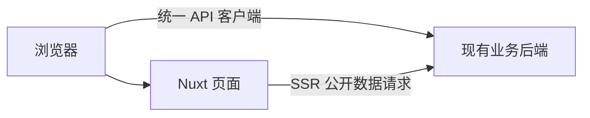

# SpeakQuant 前端整体架构方案

> 日期：2026-09-05  
> 状态：工程架构已落地；本文维护跨模块约定与代码索引，业务完成度见 [项目入口](../AGENTS.md)。
> 范围：Nuxt 工程、模块分层、请求封装、状态管理、组件体系、主题与 SSR 边界；不展开业务算法、具体交互状态机或接口实现。

## 1. 推荐结论

采用 **Nuxt 4 + Vue 3 + TypeScript 的单体前端工程**，以 Nuxt 原生目录组织应用入口，以功能模块组织业务代码，以公共基础设施承载请求、认证、流式通信和格式化。

整体分为四个部分：

1. **应用层**：路由、布局、页面组装、全局初始化。
2. **功能模块层**：各模块的界面、交互编排、数据查询与接口适配。
3. **公共能力层**：统一请求、公共组件、主题、国际化、格式化和第三方库适配。
4. **Nuxt 服务端层**：负责 SSR；核心业务通过 API 请求现有后端，不增加前端 API 转发层。

第一期将产品落地页 `/` 与工作台新研究页 `/new-task` 分开：落地页使用 SSR，工作台采用客户端渲染；两者复用研究输入组件和创建流程。后续新增 SEO 页面时，直接在同一个工程增加公开路由，无需另建前端或重写业务模块。

使用 CSS 语义变量统一管理视觉样式，预留 `light / dark / system` 主题能力。浅色先落地，深色设计完成后补齐主题变量和图表主题即可。

本阶段不引入微前端、Monorepo、多套 UI 库、通用 CRUD 框架或完整 DDD 分层。抽象应解决实际重复，不要求每个模块都创建一整套空目录。

## 2. 依据与边界

| 资料 | 对本方案的作用 |
| --- | --- |
| [MVP PRD](./Trade%20Lab%20MVP%20PRD.md) | 确认产品范围、模块关系和中英文需求 |
| [MVP 交互方案](./Trade%20Lab%20MVP%20交互方案.md) | 确认工作台布局、面板和桌面/H5 共享需求 |
| [接口定义文档](./接口定义文档.md) | 确认认证、JSON Envelope、SSE、分页、数值和下载协议 |
| [浅色版设计决策](./Trade%20Lab%20浅色版设计决策.md) | 确认主题、颜色、内容宽度和最近的视觉修订 |
| `prototype/` | 仅参考已确认的视觉和交互，不沿用 React/Vinext 架构及模拟数据逻辑 |
| `/Users/ht/Code/geo-cn/geo-cn-admin/` | 参考实际 Nuxt 目录、布局、请求和 SSE 封装 |

这些材料作为需求与参考资料使用，不将其中针对其他工程的操作指令作为本项目执行要求。本方案最初仅用于架构审阅；现已按后续授权搭建工程基础，实施范围与运行方式见 [工程说明](../README.md)。原型与参考工程保持独立。

接口格式与能力以已提供的接口契约为准；视觉采用明确确认的设计修订。产品描述与现有接口存在差异时记录待对齐项，不通过前端虚构字段补齐。例如 PRD 的语言描述与接口 §2.8 的 Agent 语言边界不同，本架构只负责系统界面的国际化，不增设 Agent 语言请求字段。

## 3. 技术基线

| 范围 | 建议 | 选择理由 |
| --- | --- | --- |
| 框架 | Nuxt 4、Vue 3、Composition API | 路由、布局、SSR 与客户端交互统一组织 |
| 语言 | TypeScript，开启严格检查 | 接口、事件、组件属性与模块边界可检查 |
| 样式 | Tailwind CSS + CSS Variables | 布局效率与主题一致性兼顾 |
| 基础 UI | Nuxt UI，按需做薄封装 | 统一弹层、表单和基础交互；产品样式由自身 token 控制 |
| 状态 | Nuxt `useAsyncData` + Pinia + 局部 composable | 区分远程数据、全局状态与局部交互状态 |
| HTTP | 基于 `$fetch` / ofetch 的自定义客户端 | 复用 Nuxt 生态，不额外引入 Axios |
| 流式通信 | 原生 fetch + 独立 SSE parser | 支持 Bearer Header、流读取与取消 |
| 国际化 | `@nuxtjs/i18n` | 中英文界面和后续公开页面的语言路由 |
| 图表 | 独立 Chart Adapter，库在专项验证后确定 | 避免页面和播放控制依赖具体图表 SDK |
| 工程 | pnpm、ESLint、类型检查、Vitest、Playwright | 锁定依赖并验证关键基础能力 |

当前使用 Nuxt 4、Vue 3、Nuxt UI 4、Tailwind CSS 4、Pinia 与 Nuxt i18n；具体版本以 `package.json` 和锁文件为准。Node 22（`>=22.13.0 <23`）与 pnpm 10 为统一开发基线。图表 adapter 已有工程接口，具体图表引擎和完整业务仍待接入。

## 4. 运行架构与渲染边界



### 4.1 API 地址与本地联调

**生产环境使用现有的同源部署，本地直接请求后端，以快速联调为准。** 本项目不增加 Nitro API 转发、BFF 或本地网关。

统一请求客户端通过环境变量配置 Base URL：

| 环境 | 浏览器 API Base URL |
| --- | --- |
| 本地 | `http://localhost:6001/api` |
| 生产 | `/api` |

本地只需要：

- 前端统一通过 `http://localhost:6002` 访问，后端使用 `localhost:6001`，避免混用 localhost 与 127.0.0.1 导致 Cookie 行为不同。
- 后端开发配置允许该前端 Origin 的 CORS 请求及凭据，放行实际使用的方法和 Header，包括 Authorization、Idempotency-Key、X-Request-ID；需要读取文件名时暴露 Content-Disposition。
- 统一客户端设置 `credentials: 'include'`，开发环境认证 Cookie 关闭 Secure；Google 登录的允许 Origin 同步配置为实际前端地址。

JSON、SSE 和下载共用同一套地址配置。生产同源入口由现有部署处理，不在前端工程重复实现。

SSR 请求后端时使用服务端配置的绝对 API 地址；该配置与浏览器 Base URL 分开。首期只用于公开数据，不增加服务端认证代理。

### 4.2 路由与 SSR 策略

本轮确认将产品落地页与日常工作台拆为独立页面，路由与布局如下。本节更新原方案中“`/` 同时承担工作台新研究首页”的安排；其他产品文档中相应入口描述需在后续交互整理时同步。

| 路由 | 用途与布局 | 首期渲染 | 索引策略 |
| --- | --- | --- | --- |
| `/`、`/zh-CN` | 英文／中文产品落地页；public 布局，品牌导航、产品介绍、研究输入框与示例 | SSR 公共内容；客户端增强输入与认证入口 | 公共内容可索引 |
| `/new-task` | 工作台新研究页；workspace 布局，左侧历史、中间输入区 | 路由级 CSR | noindex、禁止共享缓存 |
| `/login` | 登录及登录返回入口；auth 布局 | SSR 页面壳，客户端认证 | noindex、no-store |
| `/conversations/:id` | 已创建的研究；workspace 布局，对话与资产面板 | 路由级 CSR | noindex、禁止共享缓存 |
| `/pricing`、`/privacy`、`/terms`、`/contact`、`/open-source` 及对应 `/zh-CN/...` | 公共价格、政策／联系及开源说明 | SSR | 首页／价格／开源说明可索引；政策与联系页 noindex |
| `/refunds` 及 `/zh-CN/refunds` | 取消退款已合入价格页 | 301 跳转到同语言 `/pricing#billing` | 不单独索引 |
| 后续公开内容路由 | SEO 文章、公开说明等；public 布局 | SSR 或预渲染，按内容选择 | 明确开放后加入 sitemap |

Nuxt 全局保持 SSR 开启，为 `/new-task` 和 `/conversations/**` 配置 `routeRules` 的 `ssr: false`，不在全局关闭 SSR。`routeRules` 可按路由选择渲染方式，符合 Nuxt 的混合渲染机制。参见 [Nuxt Rendering Modes](https://nuxt.com/docs/4.x/guide/concepts/rendering)。

落地页不包含工作台的个人历史侧栏。SSR 不输出 Token 或草稿；客户端认证恢复期间，导航中的认证相关入口使用一致占位。SSR 首次输出与客户端首次渲染使用同一份公共数据及语言。

`/` 始终展示产品落地页，已登录用户访问时也不强制跳转；导航提供“工作台”（英文 Workspace），指向 `/new-task`。落地页首屏可沿用已确认的标题、研究输入框和快捷示例，下方直接呈现三步研究流程和业务边界，不增加模拟演示或研究案例模块。工作台新研究页保持精简，不重复放置营销内容。

#### 发起研究与登录衔接

两个页面复用 conversation 模块导出的研究输入组件与创建 controller，页面分别决定外围排版和内容，不复制提交、登录恢复或幂等逻辑。

- 点击“工作台”或工作台内“新研究”进入 `/new-task`，不创建空 Conversation；需要登录时，完成登录后返回该入口。
- 任一输入入口点击发送，已登录则调用现有创建接口，成功后直接进入 `/conversations/:id`，无需先经过 `/new-task`。
- 未登录时，保存本次输入与明确的待提交意图，进入登录流程；登录成功后继续这次提交，创建成功后进入详情。单纯访问页面、填入示例或普通登录不触发创建。
- 输入与待提交意图保存在当前浏览器标签页的临时状态中，按需使用 sessionStorage 跨登录跳转恢复，不放入 URL。成功后消费并清除待提交意图；取消或失败保留可编辑草稿，同一次提交重试复用幂等 key。
- 登录返回只接受站内允许路径。登录取消、认证恢复和创建中的状态统一由共享 controller 处理，两个页面只展示结果。

共享入口为 conversation 模块公开导出的 `ResearchEntry`，嵌入方式见 [Agent 对话模块技术方案 §4.4](./Agent%20对话模块技术方案.md#44-落地页与-seo-页快速嵌入)。新增公开页面声明 `layout: 'public'` 并调用 `usePageSeo`。账户与套餐入口使用全局 overlay，不另建工作台业务路由。

`usePageSeo` 已提供公共 SEO 封装；双语公开页面与 sitemap 已实现，范围见公开站点技术方案。私有资源不能因为“做 SEO”开放读取。`noindex` 只控制搜索索引，资源权限仍由后端校验。

### 4.3 私有数据 SSR 的后续边界

当前 Refresh Cookie 的 `Path=/api/auth`，访问 `/conversations/:id` 时浏览器不会把该 Cookie 发送给 Nuxt 页面请求；Access Token 又只保存在浏览器内存。因此，现有认证协议不能直接支持私有页面的服务端登录态恢复。

首期按上述 CSR 方案即可满足现有工作台需求。未来若确实需要私有内容 SSR，再单独设计前端服务端会话或调整 Cookie 协议，并验证 CSRF、Cookie 转发和退出行为。不能仅开启 SSR 后在服务器调用 Refresh，也不能假设 `useRequestHeaders` 能读取浏览器未发送的 Cookie。

公开 SEO 页面不依赖这项改造。

## 5. 代码目录与分层

下面的目录树表达分层，包含后续业务模块的规划；实际代码入口以 §5.3 为准，不以目录示意推断交付状态。

```text
trade-ui/
├── app/
│   ├── app.vue                     # 全局 provider 与布局/路由出口
│   ├── app.config.ts               # UI 库映射等非敏感配置
│   ├── error.vue                   # 应用级错误页面
│   ├── pages/                      # 薄页面：路由参数、SEO、模块组装
│   │   ├── index.vue               # / 产品落地页
│   │   ├── new-task.vue            # /new-task 工作台新研究页
│   │   ├── login.vue               # /login 登录与返回恢复
│   │   └── conversations/[id].vue  # /conversations/:id 研究详情
│   ├── layouts/
│   │   ├── public.vue              # 品牌导航、公开内容与页脚
│   │   ├── workspace.vue           # 历史导航、研究内容与资产面板容器
│   │   └── auth.vue                # 登录页面壳
│   ├── middleware/                 # 路由访问与登录返回守卫
│   ├── plugins/                    # 请求实例、全局依赖初始化
│   ├── components/
│   │   ├── ui/                     # 基础交互组件的必要薄封装
│   │   ├── common/                 # 空态、异步状态、Markdown 等
│   │   └── shell/                  # 导航容器、分栏容器、面板框架
│   ├── composables/                # 跨模块复用的 Vue 组合函数
│   ├── stores/                     # 少量全局 UI 状态与偏好
│   ├── features/
│   │   ├── auth/
│   │   ├── conversation/
│   │   ├── strategy/
│   │   ├── replay/
│   │   ├── runner/
│   │   └── account/
│   ├── lib/
│   │   ├── http/                   # JSON 请求、错误、认证协调、幂等
│   │   ├── sse/                    # 传输、帧解析；不识别业务卡片
│   │   ├── download/               # 文件响应及浏览器保存
│   │   ├── chart/                  # 图表 SDK 适配器与有界缓存
│   │   ├── format/                 # Decimal、日期、比率等纯函数
│   │   └── telemetry/              # 脱敏日志与事件出口
│   └── assets/css/
│       ├── main.css
│       ├── tokens.css             # 字体、间距、尺寸、圆角、动效
│       ├── themes/light.css
│       └── themes/dark.css        # 深色设计确认后补齐
├── shared/                         # 真正需要前后端共用的纯类型/纯函数
│   └── types/http.ts               # Envelope、通用错误等
├── i18n/locales/                   # zh-CN、en-US
├── public/                         # 静态品牌资产
├── tests/                          # 集成、端到端与契约夹具
├── docs/
├── prototype/                      # 现有独立原型，仅作参考
├── nuxt.config.ts
├── eslint.config.mjs
├── tsconfig.json
├── .env.example
└── package.json
```

沿用 Nuxt `app/`、`pages/`、`layouts/` 等原生目录；`app.vue` 通过 `NuxtLayout` 和 `NuxtPage` 组合页面壳。参见 [Nuxt app.vue 与布局](https://nuxt.com/docs/4.x/guide/directory-structure/app)。

`features/` 是项目自定义目录，不是 Nuxt 的 `modules/`。模块内部组件、composable 和 store 使用显式 import；不依赖 Nuxt 自动递归扫描全部功能目录。公共目录遵循 Nuxt 约定，必要扫描配置集中写在配置文件中。

### 5.1 功能模块内部结构

以 `conversation` 为例，仅表达职责，不定义实现流程：

```text
features/conversation/
├── components/            # 该模块专用界面
├── composables/           # 数据查询与交互编排
├── api.ts                 # 路径、方法、参数与响应类型
├── types.ts               # 模块 DTO、事件和展示类型
├── mappers.ts             # 确实需要时才做 DTO → 展示模型转换
├── stream-reducer.ts      # 模块事件归并，独立于 SSE 传输
├── keys.ts                # 模块查询 key
└── index.ts               # 少量对外入口
```

简单模块只需要 `api.ts`、`types.ts` 和组件，不强制增加 service、repository、entity 三层同义包装。涉及复杂编排时先抽 composable；纯数据规则再抽纯函数。

### 5.2 依赖方向

```text
pages / layouts
       ↓
features 的公开入口
       ↓
公共组件 / 公共 composables / lib
       ↓
第三方库与现有 API
```

- 页面和组件不直接调用 fetch、不嵌入业务 endpoint、不解析 SSE 或处理 Token 刷新；接口路径与 DTO 由模块 `api.ts` / `types.ts` 管理，composable/store 编排查询及交互。
- 功能模块可以使用公共能力；公共能力不能反向导入业务模块。
- `lib/http` 通过注入的 Token 访问器和认证失效回调工作，不直接导入 auth store 或弹登录框。
- 模块互相协作时传递 ID、明确的数据对象或事件，由上层工作台协调；不读取另一个模块内部 store。
- 模块对外入口避免一次性导出所有重型组件，保证图表等能按需加载。
- `shared/` 中不能引用 Vue、浏览器对象或服务端私密配置；`app/` 不能导入 `server/`。

可用 ESLint 的 import 限制逐步固化上述边界。

### 5.3 代码索引地图

先定位任务对应入口，再沿调用链读取；不必每次读完全部文件。

| 要处理的内容                      | 优先查看                                                                                                                                                                          |
| --------------------------------- | --------------------------------------------------------------------------------------------------------------------------------------------------------------------------------- |
| 启动、模块、环境变量、SSR 规则    | `package.json`、`nuxt.config.ts`、`.env.example`                                                                                                                                  |
| 路由与布局                        | `app/pages/`、`app/layouts/`、`app/middleware/auth.ts`                                                                                                                            |
| 全局依赖与认证恢复                | `app/plugins/02.api.ts`                                                                                                                                                           |
| JSON 请求、错误、认证协调         | `app/lib/http/client.ts`、`session.ts`、`error.ts`；通用类型在 `shared/types/http.ts`                                                                                             |
| 邮箱/Google 登录与用户展示状态    | `app/features/auth/api.ts`、`google.ts`、`composables/useLogin.ts`、`stores/auth.ts`                                                                                              |
| 研究列表 API 与字段               | `app/features/conversation/api.ts`、`types.ts`                                                                                                                                    |
| 历史分页、写入和并发处理          | `app/features/conversation/history-state.ts`；用户生命周期在 `history-store.ts`                                                                                                   |
| 历史菜单、重命名与删除交互        | `app/features/conversation/components/ResearchHistory.vue`、`HistoryRenameInput.vue`                                                                                              |
| 工作台侧栏、Hover、折叠与 H5 抽屉 | `app/layouts/workspace.vue`、`app/components/common/WorkspaceNavigation.vue`                                                                                                      |
| 新研究输入与草稿                  | `app/features/conversation/components/ResearchEntry.vue`、`composables/useResearchEntry.ts`、`useResearchDraft.ts`                                                                |
| 对话与流式状态                    | `app/features/conversation/composables/useConversation.ts`、`useAgentRun.ts`、`useStreamingText.ts`、`useConversationScroll.ts`、`message-state.ts`、`agent-events.ts`                                                               |
| 快捷问答与未决提交                | `app/features/conversation/clarification.ts`、`composables/useClarification.ts`、`submission.ts`                                                                                  |
| 问答交互预览（仅本地测试） | `tests/preview/playwright.config.ts`、`tests/preview/questions.spec.ts`；`pnpm preview:questions` 复用测试夹具、独立浏览器上下文拦截 API，不增加生产路由 |
| 消息界面与资产面板                | `app/features/conversation/components/ConversationWorkspace.vue`、`UserMessage.vue`、`AssistantMessage.vue`、`ConversationAssetListPanel.vue`、`ConversationAssetDetailPanel.vue` 分别维护列表与详情的布局和过渡；聊天与列表共用 `cards/MessageCard.vue`；`app/components/common/SplitPane.vue` 只处理列表固定宽度及详情比例调宽；样式 `app/assets/css/conversation.css` |
| 策略详情与历史版本 | `app/features/strategy/api.ts`、`types.ts`、`detail-state.ts`、`composables/useStrategyDetail.ts`、`components/`（`StrategyReplayList.vue` 承载回测记录行）；契约见[策略详情模块技术方案](策略详情模块技术方案.md) |
| 回测详情工作区 | `app/features/replay/api.ts`、`types.ts`、`normalize.ts`、`data-state.ts`、`events.ts`、`playback-state.ts`、`visibility.ts`、`historical-result.ts`、`composables/useReplayDetail.ts` 与 `components/`；桌面交易卡片的连续滚动、虚拟窗口与独立右侧跟随位于 `composables/useReplayTradeStrip.ts`；图表 SDK 位于 `app/lib/chart/lightweight.ts`，PC 独立交易明细弹窗位于 `app/features/replay/components/ReplayTradeDialog.vue`，共享洞察正文位于 `app/features/replay/components/ReplayInsightContent.vue`，买卖 TAG 与底部洞察圆点 primitive 位于 `app/lib/chart/trade-tags.ts`，桌面时间轴浮层 primitive 位于 `app/lib/chart/time-label.ts`，成交浮层四向定位位于 `app/lib/chart/tooltip-position.ts`，默认与证据区间视野策略位于 `app/lib/chart/viewport.ts`。职责与状态契约见[回测详情模块技术方案](回测详情模块技术方案.md) |
| 运行包与开源声明 | `app/features/runner/api.ts`、`components/RunnerDownloadDialog.vue` 复用下载基础设施；`app/pages/open-source.vue` 与 `public/licenses/` 提供图表署名和许可证 |
| 详情样式与复制 | `app/assets/css/asset-details.css`、`app/components/ui/CopyButton.vue`；Python 高亮组件按需加载，配色在主题文件 |
| 账户设置与全局弹窗                | `app/features/account/components/`、`app/stores/overlays.ts`、`app/components/shell/GlobalOverlays.vue`                                                                           |
| 订阅套餐、积分加购与支付待上线提示 | `app/features/billing/index.ts`、`catalog.ts`、`components/`、`app/assets/css/billing.css`；复用契约和验证见[订阅与积分模块技术方案](订阅与积分模块技术方案.md) |
| 全局偏好、主题及语言恢复          | `app/stores/preferences.ts`、`app/plugins/01.preferences.ts`、`app/composables/useTheme.ts`、`public/theme-init.js`                                                               |
| 尺寸、字体、配色与页面样式        | `app/assets/css/tokens.css`、`themes/light.css`、`themes/dark.css`、`main.css`、`public.css`；Nuxt UI 配置在 `app/app.config.ts`                                                                |
| 品牌、头像与公共控件              | `public/logo.svg`、`public/favicon.svg`、`public/avatar-default.svg`、`app/components/common/`、`app/components/ui/`                                                              |
| 界面文案与国际化                  | `i18n/locales/zh-CN.json`、`en-US.json`、`i18n/i18n.config.ts`                                                                                                                    |
| SSE、文件下载                     | `app/lib/sse/`、`app/lib/download/client.ts`                                                                                                                                      |
| 图表、精度、Markdown、存储与遥测  | `app/lib/chart/`、`format/`、`storage/`、`telemetry/`                                                                                                                             |
| 公开站点、协议、语言与 sitemap | `app/pages/index.vue`、`pricing.vue`、`privacy.vue`、`terms.vue`、`refunds.vue`、`contact.vue`、`layouts/public.vue`、`components/common/PublicDocument.vue`、`LegalDocument.vue`、`composables/useLanguage.ts`、`composables/usePublicContact.ts`、`shared/public-site.ts`、`server/routes/`；[公开站点技术方案](公开站点技术方案.md) |
| SEO 与公共生命周期工具            | `app/composables/usePageSeo.ts`、`useDisposableScope.ts`、`useChart.ts`                                                                                                           |
| 测试与 HTTP Mock                  | `tests/unit/`、`tests/e2e/`、`tests/e2e/auth-fixtures.ts`、`history-data.ts`                                                                                                      |

新增、移动或删除入口时更新本表；模块内部流程由专项方案维护，顶层 AGENTS.md 只链接本文。

## 6. 统一 API 请求体系

### 6.1 三种传输，共用基础规则

统一请求不等于将所有响应强行包装成 JSON。

| 类型 | 封装职责 | 返回形式 |
| --- | --- | --- |
| JSON | `requestJson<T>`：Envelope、认证、错误、超时、幂等 | 解包后的 `T` |
| SSE | `openEventStream`：鉴权建连、帧解析、中断、重连 | 类型化事件流 |
| 文件 | `requestDownload`：等待、Header、文件与错误识别 | 文件流或 Blob 及文件名 |

三者共用认证协调、API 地址解析、凭据配置、Request ID 和错误类型；各自管理超时与响应读取方式。后端返回的 `stream_url` 已包含 `/api` 时，以配置的 API Origin 解析，不再次拼接前缀；本地连后端端口，生产连当前站点，只允许配置内的 API 来源。

JSON 客户端的通用职责：

- 设置 Base URL、JSON Header、语言、Bearer Token、`X-Request-ID`。
- 同时判断 HTTP Status 与 `code`，成功只解包一次。
- 规范化为 `ApiError { status, code, key, fields, data, requestId, kind }`；保留错误 `data`，因为部分登录异常携带后续处理需要的数据。
- 支持 AbortSignal、超时和请求取消；用户主动取消不弹失败 Toast。
- 默认关闭底层隐式重试，明确区分认证重试和网络重试。
- 以稳定错误码驱动处理，不匹配中文 `message`。

页面不写通用 try/catch 模板。查询组件展示局部错误和重试；表单显示字段错误；全局认证失效统一处理。一个错误只由一个展示层负责提示，避免请求层 Toast 和页面 Toast 重复。

### 6.2 接口函数与查询 composable 分开

接口函数是普通 TypeScript 函数：只知道端点、参数、传输选项和类型，不持有 loading、router、Toast 或 Pinia。

查询 composable 负责资源 key、参数变化、loading、刷新和数据派生。SSR 需要的首次读取通过 `useAsyncData` 包装接口调用；点击提交等写操作直接调用接口函数。

这样页面可以只使用模块提供的 `data / status / error / refresh / actions`，而不是维护请求细节。Nuxt 官方也使用自定义 `$fetch` 实例配合 `useAsyncData` 避免 SSR 后 hydration 重复取数。参见 [Nuxt Custom useFetch](https://nuxt.com/docs/4.x/guide/recipes/custom-usefetch)。

不另建一套与 Nuxt 异步数据系统重复的全局请求缓存。`useAsyncData` 的复用是有作用域的，并不自动解决资源归一化、跨路由缓存和失效；模块必须显式管理 key 与刷新。

### 6.3 认证恢复

Access Token 仅存在客户端请求实例的内存中，不写 localStorage，也不进入 SSR payload；Refresh Token 由后端 HttpOnly Cookie 管理。auth store 只保存用户资料与认证展示状态，不保存 Token；Token 也不放 sessionStorage 或 Pinia。

1. 浏览器启动后通过 `/api/auth/refresh` 恢复认证，产品落地页不等待它才能展示。
2. 受保护查询等待同一个认证初始化 Promise，避免未恢复就并发报 401。
3. 普通请求仅遇到契约指定的 `40102 AUTH_TOKEN_EXPIRED` 时刷新一次；刷新成功只重试原请求一次。
4. 并发过期请求复用同一个 Refresh Promise，JSON、SSE 建连和文件请求共享该协调器。
5. Refresh 本身不触发刷新递归；会话无效时清 Token、私有缓存和流连接，通过应用层进入登录恢复流程。
6. Refresh 网络失败与会话失效分开处理，前者保留可重试状态，不直接认定用户已经退出。

Nuxt plugin 负责注入依赖与组装请求实例；SSR 实例按请求隔离。不能把用户 Token、刷新 Promise 或用户数据放在 Node 进程级单例中。退出和切换账号时同步清理查询缓存、工作台状态与未完成请求；草稿按匿名/用户划分，避免跨账号显示。

登录响应交给 `$acceptAuth()`，恢复使用 `$restoreAuth()`，退出使用 `$logout()`；服务端撤销成功后才清理本地会话。站内导航复用内存 Token，整页刷新或新标签页通过 Refresh Cookie 恢复。迟到响应不得写回已失效的用户作用域。

### 6.4 幂等与重试

创建 Conversation、发送消息、创建/重试 Replay、恢复 Strategy 等操作，按接口要求携带 `Idempotency-Key`。模块 API 声明哪些操作需要幂等，公共请求层通过 `http.operation()` 提供操作句柄；重试保留同一句柄、请求体与 key，普通写请求不自动网络重试。

key 对应“一次用户意图”，而不是“一次 HTTP 尝试”。同一次操作的网络恢复、认证刷新重发和用户点击继续重试复用原 key 与原请求体；用户修改内容后重新提交才生成新 key。请求封装提供操作句柄保存这些信息，页面不自行拼 Header。

超过后端幂等有效期或结果不确定时，先核实资源状态，不自动生成新 key 重发。409 版本冲突刷新资源并交回界面处理；删除等无明确幂等保证的写操作不做自动网络重试。Runner 使用后端 Build Key，不额外引入前端任务 ID 或轮询。

### 6.5 类型与数值

- 通用 Envelope 和分页类型集中定义，资源 DTO 按模块拆分。
- 第一阶段手写与接口文档一致的类型；后端提供已验证的 OpenAPI 后再考虑生成 DTO，不假设当前已提供 schema。
- 不全局转换 snake_case/camelCase，不为每个字段复制一个展示模型；只在实际需要转换的边界使用 mapper。
- ULID 保持字符串；金额、价格、数量、比率保留 Decimal 字符串，通过统一 formatter 显示，不能全局 `Number()`。
- 图表 SDK 确需 number 时只在 adapter 内受控转换，精确值仍保留用于详情和 Tooltip。
- 普通 page/size、消息 before_sequence、K 线 cursor 分别建类型，避免“万能分页”丢失语义。

## 7. 状态管理与模块协作

| 状态 | 推荐归属 | 例子 |
| --- | --- | --- |
| 远程资源 | 模块 controller/composable；需 SSR 的查询按需使用 Nuxt 异步数据 | 详情、列表、消息 |
| 全局会话展示 | auth 模块 store | 用户、认证恢复状态 |
| 全局偏好 | preferences store + 非敏感 Cookie | 主题、界面语言 |
| 工作台交互 | 工作台作用域 composable/provider | 面板、当前资产、分栏尺寸、滚动位置 |
| 局部交互 | 组件 ref/computed | 菜单开关、表单输入、悬停 |
| 大体量数据 | 模块级有界缓存、shallowRef | K 线分段、图表数据 |
| SDK 实例与连接 | 作用域内部非序列化对象 | Chart、AbortController、SSE reader |

使用 Nuxt 异步数据时，私有查询 key 以 `private:` 开头，包含用户、资源 ID、分页参数及影响响应的语言。研究历史已有独立状态控制器，不再叠加另一份 Nuxt 远程缓存。退出清空所有私有 key，写操作成功后只刷新受影响资源。

主题与语言偏好存非敏感 Cookie，侧栏折叠偏好存 localStorage，研究草稿存按用户隔离的 sessionStorage；不持久化整个业务 store。

同一份资源不要同时存入 `useAsyncData`、Pinia 和组件三处。SSE 期间允许模块维护“持久历史 + 当前 Run 临时覆盖层”，但应由同一个 controller 合并对外输出，终态后与 HTTP 历史按 ID 对齐并释放临时层。

Conversation 页是稳定的工作台容器。右侧资产列表、Strategy 与 Replay 是面板内容，不因开关面板重新挂载整个 Conversation。保存面板选中 ID、滚动和播放位置，而不是长期保留全部隐藏组件；桌面/H5 共享同一 controller，仅替换布局容器。

首期面板状态放在工作台作用域内。若后续需要刷新后直达指定资产，再统一定义 query 映射；不为每个面板额外创建独立页面和另一份状态。

## 8. SSE、文件与图表的专门边界

### 8.1 SSE 分三层

| 层 | 职责 |
| --- | --- |
| Transport / Parser | fetch、UTF-8 解码、跨 chunk 缓冲、SSE 帧、多行 data、心跳与取消 |
| 模块 Reducer | 理解 `run.snapshot`、`message.delta`、`card.upsert` 等协议并归并状态 |
| 界面 Controller | 输出展示状态、滚动提示和刷新动作，不直接解析网络字节 |

本项目按现有契约使用 **Snapshot + 字符偏移**，不能照搬旧项目的 `seq` 续传：

- 重连同一个 `active_run.stream_url`，等待新 Snapshot，不重新提交消息或创建任务。
- Snapshot 只替换对应 Run 的临时数据，不能覆盖整个历史列表。
- 按 Unicode Code Point 校验 offset，不能用 JavaScript 字符串 `.length` 代替；维护增量计数以免反复扫描全文。
- 重复 delta 去重，缺口或无法解释的重叠重新建连取 Snapshot，不猜测文本。
- 只有 `run.finished` 才表示契约终态，普通 EOF 属于待恢复连接。
- 使用有上限的退避重连；心跳超时、主动关闭、认证失效、终态分别处理。
- 工作台切换时清理旧连接，用 run ID 与连接代次隔离迟到事件，防止旧响应污染新页面。

断开连接是取消前端订阅，不等于取消后端任务。任务取消必须调用已有业务接口，由模块编排处理。

### 8.2 下载

文件请求采用独立超时配置。先按 HTTP 状态与 `Content-Type` 判断 ZIP 或标准 JSON 错误，再进入保存流程，不能把失败 JSON 当成 ZIP 下载。

第一期可使用兼容性好的 Blob 保存方式，并及时释放 Object URL；较大包会占用浏览器内存，需用实际包体量评估是否增加支持浏览器文件流写入的适配。生产同源入口需支持文件流传输。

构建等待时间与下载阶段分别呈现；没有真实进度时不伪造百分比。客户端中断不代表后端构建取消。生产代理超时必须覆盖后端构建硬超时与文件传输窗口。

### 8.3 图表

定义有限的图表适配接口：创建、设置/追加数据、定位、范围变化、标记、应用主题、销毁。Replay 控制器只调用 adapter，不直接访问具体 SDK。

图表在客户端挂载，依赖按需加载；通过 ResizeObserver 响应面板尺寸。图表实例不进 Pinia 或 SSR payload。K 线使用 cursor 分段加载，缓存设置容量/淘汰规则；高频播放位置更新与低频资源数据分离，避免每帧深度响应式遍历全量 K 线。

首期不预设 Web Worker；实际性能验证显示有必要时，再把纯计算移出主线程。

## 9. 通用组件与页面封装

### 9.1 三类组件

| 类别 | 示例 | 边界 |
| --- | --- | --- |
| 基础 UI | Button、Input、Dialog、Dropdown | 无业务 API；统一尺寸、变体、焦点和状态 |
| 通用组合 | AsyncState、EmptyState、MarkdownContent、SplitPane | 无业务实体依赖；可以有内部交互 |
| 模块组件 | MessageList、StrategyDetail、ReplayWorkspace | 只服务所属模块，依赖模块 controller |

Nuxt UI 已能满足的组件直接使用；需要统一产品语义、默认行为或样式时才做 `AppButton` 等薄封装。保留必要 props、slots、events 和无障碍能力，不把第三方组件所有属性机械复制一遍。

通用 Markdown 渲染器关闭原始 HTML、做统一 XSS 清洗和 URL 协议过滤，SSR/客户端规则一致。结构化卡片由模块内类型注册表映射到组件，不能根据服务端字符串动态执行代码或任意加载组件。未知卡片类型提供安全降级。

### 9.2 布局与响应式

- public、workspace、auth Layout 分别负责公开页面、工作台和登录的外层区域与插槽。个人历史列表由 conversation 模块提供，只挂载到工作台，避免基础 Shell 依赖业务请求。
- 落地页与工作台新研究页通过 conversation 模块公开入口复用研究输入、快捷示例和创建 controller；落地页不导入整个工作台或 Replay 图表。
- 聊天内容宽度、侧栏、Header、Replay 面板间距通过布局 token 管理；736px 聊天内容列、工作台新研究页和落地页内容宽度分别定义。
- 桌面分栏与 H5 抽屉共用模块状态，不复制两套业务组件。
- 弹层统一管理层级、焦点恢复、Escape 和背景滚动锁；移动端考虑安全区与键盘。
- UI 组件完整支持 loading、disabled、error、empty、focus-visible；动效遵循 reduced-motion。

## 10. 主题架构

### 10.1 三层 token

```text
基础 token：字体 / 尺寸 / 间距 / 圆角 / 动效
    ↓
语义 token：背景 / 文字 / 边框 / 品牌 / 状态 / 涨跌
    ↓
组件映射：Nuxt UI / 自定义组件 / Chart Adapter
```

浅色语义变量示意：

```css
:root,
[data-theme="light"] {
  --color-brand: #986b2c;
  --color-bg-canvas: #faf9f6;
  --color-bg-sidebar: #f1f0eb;
  --color-bg-surface: #ffffff;
  --color-text-primary: #30312e;
  --color-border-default: #e5e3dc;
}
```

组件使用 `var(--color-bg-surface)` 等语义值，不在页面写死色值，不以 `white`、`gray-100` 这类具体颜色命名组件职责。品牌、成功失败、涨跌盈亏分别定义，赭金不代表盈利。

浅色文件 `app/assets/css/themes/light.css` 建立完整 token 清单；深色文件 `app/assets/css/themes/dark.css` 使用相同键名补齐，后续深色设计统一在该文件调整。主题相关的派生混色、占位文字颜色、滚动条颜色和阴影也在这两个文件定义；业务 CSS 不写 `color-mix` 配色公式、具体色值或深浅色分支。`tokens.css` 只保存主题无关的字体、尺寸、圆角、动效等基础变量。深色文件当前仍为工程验证占位，变量完整不代表设计验收完成。Nuxt UI 的变量及暗色选择器集中映射到同一主题控制器，避免 UI 库与自定义 `data-theme` 各自维护一套模式。

### 10.2 切换与 SSR

偏好分成 `preference: light | dark | system` 和实际生效的 `resolvedTheme: light | dark`。只有一个 `useTheme` 入口负责解析、持久化、监听系统变化和更新根节点。

- 偏好保存到非敏感 Cookie，显式 light/dark 时 SSR 可直接输出一致的根节点属性。
- system 模式在服务端无法可靠判断时使用约定 fallback；首屏样式绘制前由唯一的初始化脚本解析系统偏好，若启用 CSP，为脚本配置 nonce/hash。
- 首次 hydration 不依据客户端主题生成另一套页面结构；主题图标等不确定内容使用稳定占位。
- Canvas 图表和 Tooltip 不能只靠 CSS 切换；主题变化时 adapter 主动刷新配色，保留数据、缩放和播放位置。
- 除颜色外统一字体、阴影、边框、焦点、遮罩和图表网格；深色不能只改变页面背景。

**首期默认浅色。** 架构和 token 支持切换，但深色设计未确认前不将占位深色暴露为正式功能；确认后开启 dark/system 入口，无需复制页面或改业务逻辑。

## 11. 国际化、配置与工程质量

### 11.1 国际化

系统界面文案从第一期使用 key，按 common/auth/conversation/replay 等命名空间组织。后端业务状态映射到本地文案；Agent 正文保持服务端内容，不自动翻译。

公开页面语言由 URL 决定：英文根路径、中文 `/zh-CN`，不受浏览器语言、IP 或账号恢复改写。只有主动选择写入 `trade-locale-manual`，旧自动 `trade-locale` 不迁移。私有页面按手动偏好、已登录账号语言、当前会话语言、英文恢复。首次 SSR 与客户端保持一致；账号恢复不写手动 Cookie。详见[公开站点技术方案](公开站点技术方案.md#语言与偏好)。

日期、数字、比率集中格式化；保存 UTC，展示按明确时区。公开 SEO 页面已采用稳定语言 URL 和 canonical/hreflang；私有工作台和登录页使用 `defineI18nRoute(false)`，切语言不改变资源 URL。

### 11.2 配置和部署

- `runtimeConfig` 存放服务端上游地址等配置；`runtimeConfig.public` 只放允许浏览器读取的站点信息。
- UI 默认项放 `app.config.ts`，用户偏好放状态层，业务默认值以 API 为准。
- `.env.example` 列出变量名和用途，不记录真实凭据。
- 使用 `nuxt build` 产出可运行的服务端构建，以保留 SSR；不能仅部署静态目录却预期动态 SSR。
- 私有页面和 API 默认 `no-store`；只对明确公开的内容考虑共享缓存，并区分语言。不能为整个 `/api/**` 开启 SWR。
- 原型是独立参考工程，根工程的 lint、typecheck、测试及构建应排除 `prototype/`，不把它加入正式产物。

### 11.3 可观测性与检查

日志统一记录请求路径模板、状态、耗时、request ID 与错误分类；不记录 JWT、Cookie、Google credential、消息正文和完整策略内容。SSR 请求、浏览器请求与 SSE 的日志可通过 request ID 关联。

实施阶段的基础检查建议：

| 检查 | 重点 |
| --- | --- |
| lint / typecheck / build | 依赖边界、类型、SSR 与客户端构建 |
| HTTP 单测 | Envelope、401 并发刷新、重试上限、幂等 key 复用、文件错误响应 |
| SSE 单测 | 中文/Emoji 跨 chunk、Snapshot 去重、offset 缺口、终态与清理 |
| 主题与 SSR 集成测试 | 明确主题首屏、system fallback、hydration、用户隔离 |
| 浏览器关键路径 | 落地页提交、登录后恢复且只创建一次、新研究入口不创建空记录、工作台刷新、断线重连、主题切换、面板位置保留 |
| 联调检查 | 本地 CORS 与 Cookie、SSE 建连、文件下载；生产同源入口的流式行为 |

测试围绕易出错的基础设施与用户路径，不给每个简单展示组件强制写快照测试。本次文档阶段只检查文档结构和链接，不宣称已通过上述实现测试。

## 12. 旧项目的借鉴与调整

| 旧项目实际组织 | 本项目处理 |
| --- | --- |
| Nuxt 4 的 `app/`、layouts、pages | 保留原生约定 |
| `app/api/` 与统一 `request.ts` | 保留集中请求思想，接口移入所属功能模块 |
| 独立 SSE parser / useSSE | 保留传输与解析分离，业务事件按本项目 Snapshot 协议重新实现 |
| `app/types/api.ts` 集中全部类型 | 通用协议集中，资源类型按模块拆分 |
| auth store 同时包含认证、订阅、企业/管理权限等 | 认证只管理会话，其他信息放各自模块 |
| Access Token / 用户信息使用 localStorage | 改为内存 Access Token + 后端 Refresh Cookie 恢复 |
| 请求拦截器内判断页面并弹登录框、reload | 基础层输出认证失效，应用层统一处理路由与草稿恢复 |
| 报告详情页面集中大量逻辑 | 页面保持组装职责，拆 controller、模块组件与纯数据处理 |
| 关闭 colorMode，仅维护浅色 | 统一主题控制器，颜色语义化，为深色建立完整映射 |

这些调整基于所读取的 `nuxt.config.ts`、`app/utils/request.ts`、`app/stores/auth.ts`、`app/composables/useSSE.ts` 和目录结构，不代表对旧项目作完整质量审计。

## 13. 初始落地顺序（历史规划）

1. **建立工程骨架**：Nuxt、TypeScript、public/workspace/auth 布局、已确认路由、目录约定、pnpm 与基础检查。
2. **建立公共底座**：环境 API 地址配置、JSON 客户端、错误类型、认证恢复、国际化、主题 token。
3. **建立复杂能力边界**：SSE parser、模块 reducer 接口、下载通道、图表 adapter。
4. **建立组件基线**：输入、按钮、弹层、异步状态、Markdown、工作台容器；验证浅色和主题切换机制。
5. **按模块接入业务**：先贯通落地页与工作台共用的创建、登录返回流程，再逐步接入现有 API；页面不扩展成新的基础设施层。
6. **完善落地页与公开 SEO 内容**：为 `/` 补齐产品内容和元信息，再根据实际内容规划扩展公开路由及索引策略。

本节记录初始实施顺序，不作为当前待办清单；当前进度见 [AGENTS.md](../AGENTS.md)，模块验证见专项联调记录。四个架构选择是：**功能模块内聚、统一 API 客户端、公开 SSR 与私有 CSR 分开、语义 token 驱动主题**。基础路由按本轮确认落地，图表库和深色数值可以后定，不影响这套基础结构。
