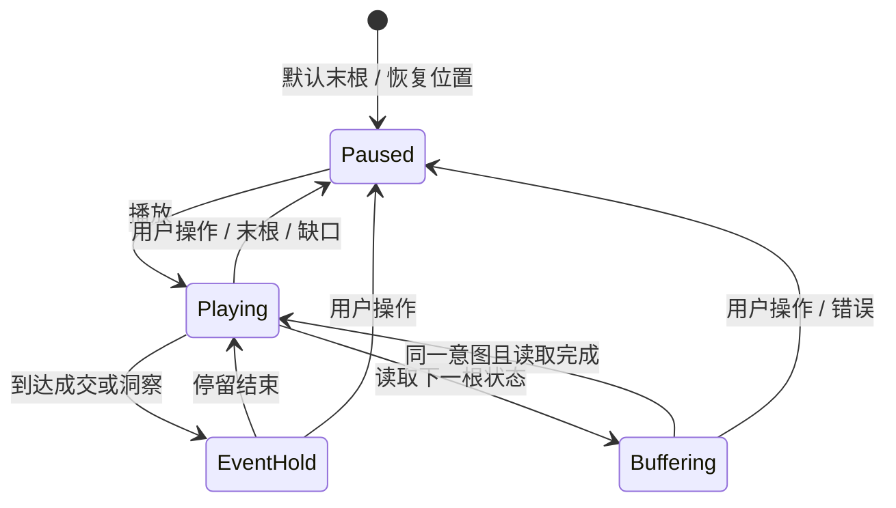

# 回测详情模块技术方案

更新：2026-09-20。状态：**前端已实现，验证范围见[回测详情联调记录](回测详情联调记录.md)**。

本文维护回测详情的实现契约。全宽图表、播放、证据定位、交易明细、报告、冻结策略往返、追问引用与运行包下载已接入前端；真实接口、模拟测试、性能与真机边界分别记录在[回测详情联调记录](回测详情联调记录.md)。

## 1. 目标、依据与范围

### 1.1 交付目标

从聊天回测卡片、资产列表或策略回测记录打开同一个 Backtest Workspace，完成“查看结果 → 检查行情与交易 → 定位洞察 → 继续研究”的闭环。

本轮沿用 Conversation 内的详情面板及全屏层，不新增独立回测页面路由；“详情页”指这套可独立打开的工作区内容。

- 对外统一使用“回测 / Backtest”“回测记录 / Backtests”“回测工作区 / Backtest Workspace”。
- 历史过程的时间推进称为“播放 / Playback”。代码目录、类型、国际化键、事件和接口继续使用 `Replay`。
- 默认首屏让用户看清**完整结果、K 线、当前证据**；通过位置、字号和交互表达主次。
- 不增加产品介绍、副标题、常驻操作教程、重复结论、装饰图表或无用占位按钮。
- 完整回测结果不随播放变化；当前时刻状态与完整结果分开。
- 只消费真实返回的数据，不在前端重跑策略、生成交易归属、编造规则解释或伪造成功状态。

### 1.2 文档关系与冲突处理

| 依据 | 本方案采用的内容 |
| --- | --- |
| [MVP 交互方案](Trade%20Lab%20MVP%20交互方案.md)，Part B、A10、D1 | 全程浏览、播放、固定 Timeline、洞察定位、首次打开、H5、下载入口 |
| [浅色版设计决策](Trade%20Lab%20浅色版设计决策.md)，§2、§3、§7、§8 | 克制表达、语义配色、详情面板、尺寸、全屏和动效 |
| [接口定义文档](接口定义文档.md)，§5.10、§9、§10 | 消息上下文、Replay 只读资源与分页、Runner 下载 |
| [前端整体架构方案](Trade%20Lab%20前端整体架构方案.md)，§5、§7、§8.3 | 模块归属、私有状态隔离、统一 HTTP、图表适配层 |
| [策略详情模块技术方案](策略详情模块技术方案.md) | 版本选择、回测范围、内部往返和焦点恢复 |
| [产品术语](产品决策.md#产品术语) | 中文、英文及内部命名边界 |

具体取舍：

1. 交互稿的“返回资产列表”不恢复为常驻按钮，沿用现有已确认规则：关闭回到聊天；用户通过资产入口重新打开列表。只有内部来源存在时显示返回按钮。
2. 洞察定位后不弹“已暂停播放，并在完整行情中查看该洞察”等常规提示。播放按钮、时间指针、图表定位和选中状态共同反馈；错误或无法定位时才出现短提示。
3. “洞察仍在生成”是早期交互设想。当前接口约定 completed 发布前数据已经生成，不添加虚假的生成中状态或轮询；请求中的 Loading 与业务生成状态必须区分。
4. 手机使用现有覆盖式详情容器，不把聊天和图表并排挤压。沿用普通详情 8px 外边距；显式全屏才铺满视口。内部布局具备完整 H5 能力。
5. 本方案中的新增尺寸、加载参数和播放时间为实施初值，需通过真机和性能验收收敛；不覆盖既有已确认的 Header、面板和全屏规范。

### 1.3 本次实现包含与不包含

**包含：**详情及同会话回测切换、冻结条件、完整指标、全宽 K 线及成交标记、由后端直接提供行情的查看周期切换、逐 K 状态、固定 Timeline、历史定位与播放、洞察及证据定位、交易列表与成交详情、完整报告、关联历史策略往返、带上下文的 Agent 追问、桌面/H5、加载及故障恢复。回测详情中的 Runner 下载入口接入真实下载请求及 ZIP 保存；真实包的生成与运行验收另见联调记录。

**不包含：**新建回测表单、重试/取消回测任务、策略恢复或代码修改、独立回测比较页、手动下单、实时行情、前端 K 线聚合或合成行情、Runner 客户端运行与交易所连接、独立公开分享页、回测重命名。现有 `PATCH /replays/{id}` 不因接口存在就增加重命名入口。

## 2. 当前实现与复用

- `ReplayDetailContent` 沿用会话详情容器，按“结果 → 全宽行情 → 播放与 Timeline → 洞察/交易”纵向排列。
- `data-state` 使用现有 `$http`、AbortController 和 BoundedCache；`useReplayDetail` 管理当前用户作用域、播放时钟、定位和最多 10 条轻量位置快照。
- `app/lib/chart/lightweight.ts` 封装锁定的 Lightweight Charts 5.2.0，SDK 仅在客户端动态加载。
- `ConversationAssetDetailPanel` 保留来源策略，另设冻结节点的只读查看状态；`ConversationWorkspace` 管理完成意图和可移除追问引用。
- `useAgentRun` 只在 live `card.upsert` 从 queued/running 转为 completed 时发出完成意图；Snapshot/历史加载不触发。
- 报告、记录选择器和 Runner 下载按操作加载；Markdown、HTTP、认证、幂等重试和 ZIP 保存复用公共模块。

## 3. 页面设计与操作流程

### 3.1 设计定案：全宽图表，一个历史截止位置

界面没有“浏览 / 播放”切换。当前主周期 K 线就是历史截止位置：所有过程数据只显示到这一根收盘。暂停保持截止位置，播放按顺序推进；把时间轴拉到最后即可查看全程。首次手动打开默认末根；有查看快照时恢复原位置并暂停。

桌面顶部指标统一跟随时间轴截止点：历史位置显示品牌色纯文字“截至此时”，末端显示弱化文字色“最终结果”，不使用底色和图标。图内 Hover、缩放和结果视野定位不改变指标。图下不再重复展示状态行；末列新增“当前持仓”，直接读取 currentState.direction 并随时间轴更新，加载、缺失或缺口显示“—”；浮动盈亏与详细状态在标题旁“查看详情”中读取。六列按内容宽度分布，末列右对齐图表右边界。手机暂保留原有展示。

策略资金以 `conditions.initial_capital` 为独立本金。实时净盈亏为主周期收盘 `state.equity - initial_capital`，净收益率为该差额除以初始本金；忽略旧 `cumulative_return_rate`，不相加单笔收益率，不再从权益扣除手续费、资金费用或滑点。权益已含浮盈亏及已发生费用。所有资金计算使用 40 位精度的 Decimal，不经 Number 或提前取展示小数；策略收益率、当前/最大回撤显示百分数 4 位小数，单笔交易收益率仍读取以入场名义金额为分母的后端字段。

`historical-result.ts` 的 `createDrawdownHistory(initialCapital, startAt, timeframe)` 同时产生指标和最大回撤证据；`data-state.ts` 按主 Candle ID 保存不可变前缀结果，删除另行扫描区间的算法。初值为初始本金峰值、条件起点时刻、最大回撤 0、区间 null；权益严格创新高才更新峰值，当前回撤严格超过既有最大值才记录峰值至谷值，同高点/同最大跌幅保留首次区间，恢复阶段不延长最大区间，无回撤不框选。点记录 `candleId/time/closeTime/equity`：图表锚定产生状态的主 K 线开盘 time，数值及详情时间对应 closeTime；初始峰值没有 Candle ID，定位在资金起点。区间为贯穿图表的时间跨度，不绘制价格高低点或权益数值对应的价格线；指标详情常显可验证的峰值/谷值权益及采样时间。

只有无 from/to 的主周期连续游标链参与计算，预览窗口与辅助周期不参与。检查主序号从 1 连续、时间从起点覆盖且逐周期相邻、权益有效、初始资金为正及收盘时点有效；缺页前只保留已完整的前缀，缺状态或时间缺口之后的全部前缀不可用，不能跳过缺口拼接。尾页声明完成但 counts 不符时不视作完整，可重试从起点重建；普通分页失败从原游标恢复。补齐后重新扫描，倒退直接读取当时的峰值、当前/最大回撤与区间。辅助周期切换不改变资金主轴。动态回撤入口复用已有 Candle ID 索引，和固定成交/洞察事件目录分开计算，播放更新谷值时不重建全量事件索引。

交易笔数统计已开仓 Trade，不按 Fill 计数；胜率和盈亏因子仅使用已完整平仓 Trade 的净盈亏，胜率分母包含持平交易。部分减仓及浮盈亏进入权益，未完成 Trade 的最终收益、未来 Fill 不参与统计。缺少有效权益前缀时历史指标及定位区间显示不可用，不能补零；当前状态加载中不保留上一根值。末端/完整概览始终使用服务端最终 result，完整权益重算的最大回撤只用于验证区间：按百分数 4 位显示精度核对，不能放大或修正结果。旧序列与结果不一致时保留后端数字并隐藏完整区间，不迁移历史数据。历史详情不展示最终方向汇总。

| 对象 | 含义与显示边界 |
| --- | --- |
| K 线 | 主周期截至当前根；辅助周期仅显示 close_time 不晚于当前主周期收盘的完整 K 线 |
| 交易记录 | 一笔 Trade；开仓已发生才出现，平仓前隐藏最终盈亏、退出原因、平仓时间与价格等汇总 |
| 成交明细 | 一次 Fill；只显示截至当前位置已经发生的成交；动作显示开多/平多/开空/平空等 |
| 洞察 | runtime 随对应 K 线出现；global 仅在末端显示 |
| 统计定位 | 桌面最大盈利、最大亏损、最大回撤收纳在图表工具栏固定的“结果定位”菜单，复用交易卡片的框选与条件平移，保留播放、进度和缩放；超出当前截止点的区间禁用。手机保留末端快捷入口；不计为时间轴事件 |

### 3.2 默认半屏：结果在上，图表全宽

桌面（视口 >760px）周期按钮与图表共用边框和背景，周期行仅以细分隔线连接绘图区；窄桌面面板仍使用可横向滚动的周期按钮。行情读数绝对定位在图内左上角，单行行内布局，不换行；宽度不足时仅读数条横向滚动，SDK 画布铺满图框，行情读数悬浮其上，网格和十字线保持贯穿；通过价格轴上方 scaleMargins 留出约 80px 的行情读数及成交 TAG 空间（随高度换算比例），TAG 顶部最低 34px。不移动画布，不创建独立行情栏，图框总高度保持原值。关闭成交量柱图不隐藏成交量文字。手机保留现有布局。

```text
[返回] 回测名称 ▾                  [查看策略] [更多] [全屏] [关闭]
BTC/USDT · 执行 1h · 永续 · 双向 · 3× · 日期范围 [条件]
[最终结果 / 截至此时]                            [查看详情]
净收益率     最大回撤     交易笔数     胜率     盈亏因子     当前持仓
─────────────────────────────────────────────────────────────
[1h] [4h]                          [结果定位 ▾] [成交量]
┌───────────────────────────────────────────────────────────┐
│ BTC/USDT · 日期时间  （图内左上角悬浮）                    │
│ 开/高/低/收 · 涨跌额/幅 · 成交量                           │
│                    全宽 K 线                              │
│               B / S 实心尖角 TAG                          │
└───────────────────────────────────────────────────────────┘
当前日期时间           [到开始] [▷ 从头播放] [到结束] [1x ▾]
┌───────────────────────────────────────────────────────────┐
│ 01/01            01/03            01/06             01/09  │
│       ●买        ●卖             ●洞察                 │  │
└───────────────────────────────────────────────────────────┘
● 买入  ● 卖出  ● 洞察                      开始日期 — 结束日期
洞察 3      交易记录 2
整体结论一行或两行                                     [展开]
```

- 常规图高 340px；手机 280px；全屏宽容器使用 440–640px。证据展开只增加纵向内容，不分走图表宽度。
- 左上行情读数含日期时间、星期、开高低收、相邻前一根收盘为基准的涨跌额/涨跌幅、成交量。成交量文字不受柱图开关影响；缺前收或存在缺口时涨跌显示“—”。Hover 更新读数，不改变当前位置。桌面开高低收与涨跌额/幅数值统一跟随该根蜡烛的开收方向使用 candle-up/down 色；收盘等于开盘沿用图表上涨色。中文字段简写“开/高/低/收”；日期与字段标题保持弱化文字样式。成交量使用正文色和 500 字重，按数量精度展示，整数不补小数位，去除末尾零且保留真实小数。
- 初始视野约末端 100 根，SDK 仅绘制可视窗口；全历史仍可平移、缩放或通过时间轴访问。“回到最新”保留用户缩放并平移回当前截止点附近，不改变截止位置。
- 时间轨道高 78px，统一日期刻度、浅色已发生区域与垂直指针。买/卖/洞察在同一轨道用不同颜色小点标记，底部只保留紧凑图例和日期范围。

### 3.3 时间轴截止与图表定位

点击或拖动时间轨道，会立即暂停、清除旧证据选择、改变截止位置并定位图表。松开保持暂停。后面的 K 线、成交、洞察及列表计数均撤回，不因之前看过而保留。

桌面端图表交互只作用于图内：拖动、缩放不暂停播放，跟随策略由操作后的实际留白决定，单纯点选不改变跟随；“回到最新”保留缩放，平滑移动到当前进度并恢复跟随；点击 K 线查看行情，悬停 B/S TAG 显示订单明细，横向优先右、空间不足才左，纵向优先上、空间不足才下，独立组合为右上/右下/左上/左下；按浮层实际尺寸避让，上方展示时上下间距 4px，左右边缘与 TAG 对齐；下方展示时浮层位于 TAG 侧边、水平间距 4px、顶边与 TAG 对齐；同根同侧多笔逐行列出时间、买卖方向和数量@成交价，鼠标可移入浮层并停留，离开两者后延迟 220ms 关闭，不提供查看明细入口。时间轴单向控制图表可见内容，不能拖到截止点之后的数据。点击播放仍从时间轴当前位置继续。手机端暂保留现有交互，后续单独调整。

时间轴点击、拖动、键盘和买卖/洞察点统一调用 `seekTime`：暂停 → 清除旧选择 → 改变历史截止位置 → 保留缩放并平移到统一回放锚点。保留查看周期，只显示截止时刻已收盘的 K 线，指标与已揭示内容同步回退；不自动框选、不增加定位竖线/价格线、不选中交易卡片或填实洞察圆点。事件点只提供时间快捷入口，悬停阅读保持原行为。桌面交易卡片及成交明细采用独立视野定位：保持播放状态并切回执行周期，选中证据并保留当前缩放比例；区间末端或成交 K 线已在实际绘图区内时不移动，否则将目标平移到绘图区宽度约 70% 处，为前后走势留出观察空间；保留时间轴截止点、顶部指标及全部已揭示 K 线。已平仓交易高亮开平仓区间，未平仓交易高亮入场至当前截止位置，继续播放时仅随截止点延长框选，平仓后固定至离场 K 线，不再次请求视野；单笔成交定位该根，洞察定位其证据区间；不揭示截止点之后的数据。`locate(target, false)` 不调用 pause，独立的证据请求代次防止迟到操作覆盖新选择；图内洞察也使旧证据请求失效。打开交易明细弹窗仍暂停以便阅读。手机保留列表定位改变截止点的原行为。

K 线 TAG 以真实 side 表示 B（买入）/ S（卖出），不能把 B/S 当作多仓/空仓。实心圆角标签带尖角、连接线和成交价锚点；附近标签避让，同根同侧多笔显示 B×n / S×n，桌面悬停逐行显示成交，手机点击再选具体成交。交易明细使用开多、平空等业务动作解释；桌面从卡片独立入口打开弹窗，手机保留底部展开。

### 3.4 播放：只推进当前位置

- 控件一直是到开始、播放/暂停、到结束、速度和当前时间。末端的主按钮显示“从头播放”，其余位置显示“播放”。没有模式名称、退出播放或返回全程按钮。
- 从头播放、中途时间跳转和回到最新共用同一布局规则，保留 K 线宽度：已揭示历史按当前缩放不足一屏时，首根靠左、后续向右增长；填至默认右侧边距后进入跟随，不因跳转到中途而空出左侧。
- 播放切回冻结执行周期；暂停后允许查看服务端支持的其他周期，截止位置不变。恢复播放仍使用执行周期。
- 时间跳转和播放跟随保留 K 线宽度；历史已铺满时，最新可见根位于绘图区约 93% 处（右侧约 7% 空间）；手动平移/缩放后，较窄边距在末根可见时继续跟随，末根完全移出右侧后保持视野；较大右侧留白保持位移，新 K 线填至默认边距后自动跟随。暂停再播放不覆盖此策略。时间轴跳转、打开阅读层、切后台会暂停；桌面交易卡片、结果定位与图内洞察保持播放状态；回前台不自动继续。手机保留原图内交互暂停行为。
- 桌面速度显示相对默认速度的 0.5x / 1x / 2x / 5x / 10x，默认 1x；手机暂保留根/秒。无事件区间不隐式快进；桌面买入、卖出和 runtime 洞察统一额外停留 min(150ms, 1000/实际根每秒)，随倍速缩短，同根合并一次短停留；手机保留成交 1.2s、runtime 洞察 2.4s 的规则。
- 桌面下方显示横向交易卡片，实时洞察通过图内与时间轴圆点悬停阅读，暂不展示总结洞察；手机保留“洞察 / 交易记录”。只更新已发生内容与计数，不自动展开、不抢滚动。

### 3.5 全屏、手机及长内容

| 面板实际尺寸 | 页面如何变化 | 图表面积与阅读方式 |
| --- | --- | --- |
| 半屏约 560–760px | 六项指标一行；日期与条件入口并入元信息首行；标题行提供查看详情 | 全宽 320–420px 高；证据在底部 |
| 调宽 / 全屏 ≥1000px | 条件可合并一行；工具栏保持紧凑，不增加新的永久区块 | 全宽，高度约 440–640px 随视口收敛；证据依然下置，不设置阅读 max-width 限制图表 |
| 窄面板 / 手机 ≤480px | 指标首屏只保留净收益、回撤、笔数，胜率/PF 进指标详情；周期下拉替代多按钮 | 全宽最低 260px 高；证据默认摘要，长内容用底部阅读层 |
| 可用高度不足 680px / 横屏 / 200% 字号 | 主体纵向滚动，Header 保持可达；不强行要求一屏容纳全部 | 保留图表最小高度；播放时控制栏在主体滚动容器底部 sticky，预留遮挡空间 |

- 实际断点用容器宽度，不能用浏览器宽度误判半屏为宽屏。中间宽度沿用半屏结构；极窄时工具栏允许换行，不缩小至难以点击。
- 手机点击 K 线/标记完成与 Hover 相同的信息查看；图表处理横向拖动/捏合，外围保留纵向滚动区域，不能整页拦截 touchmove。
- 手机 Header 沿用现有 36px 控件，工具及底部动作有效触控区域至少 44px；首屏不重复展开所有元信息，完整条件通过“条件”查看。
- 桌面“条件 / 完整指标 / 完整报告”打开面板内阅读层，手机从底部进入，最高约 80% 可用高度；阅读层为显式打开的临时覆盖，暂停播放，提供标题、关闭、内部滚动及焦点恢复。图表底层尺寸不被挤压。一次只开一个层，Escape/关闭返回原位置。
- 全屏保持同一 controller；仅 resize，保留截止位置、查看周期、指针、选中项。退出恢复原分栏宽度。不会自动扩大洞察，不重新加载资源。
- 面板自身使用一个主滚动区；证据长列表在完整阅读层内滚动，避免日常出现三级滚动。自动事件不改变页面滚动位置。

### 3.6 查看周期：主周期确定策略，展示周期服务读图

`strategy.execution_timeframe` 是这次回测的冻结执行周期；`displayTimeframe` 是本地读图偏好，两者必须分开。前者出现在条件摘要中，后者出现在图表工具栏。

**已确认决策：多周期 K 线由后端补充接口并直接返回，前端不做 OHLCV 聚合。** 可选范围由后端支持能力决定，可以包含更大或更小周期，不再受“主周期整数倍”限制。辅助周期是否可查看取决于该行情接口的支持清单；只有元信息不能当作已经有对应数据。

**接口接入：**实现期间后端新增了可选 `timeframe` 与响应 `available_timeframes`、`execution_timeframe`、`close_time`。前端只有读到能力清单才提供切换；旧响应保持执行周期。已核对源码和真实主周期响应，辅助周期端到端覆盖范围见联调记录；不以硬编码菜单声称所有周期已可用。

交互细节：

1. 默认执行周期；选项来自服务端支持清单。若支持 15m、1h、4h、1D，工具栏按该顺序展示；只有一项则显示静态周期。接口未补齐前只提供执行周期，不以本地聚合代替交付。
2. 切换周期保持可见**时间区间**，不保持蜡烛根数；回测结果、冻结条件、固定 Timeline 和主周期播放轴不变。
3. 查看周期不同时，工具栏保留简短“执行 15m”；不再显示“由 15m 聚合”。
4. 请求目标周期时保留旧图，并在目标按钮显示加载；成功后连同周期标签一起切换。连续点击仅最后一次生效；失败保持旧图和旧选中周期，并提供重试。
5. 不同周期上的成交标记按照真实成交时间和服务端明确的 K 线时间边界映射；同一根可聚合成交数量，但不合成 K 线。点击事件仍切回执行周期精确定位真实成交 ID。
6. 非执行周期 Hover 读取该周期 OHLCV；桌面单击仅查看行情，不映射或改变主周期索引。手机暂保留既有单击映射行为。辅助周期自身 state=null，不推算仓位或盈亏。
7. 播放仍按执行周期推进；开始时切回执行周期，暂停后可手动切换查看周期。多周期查看不重跑策略，也不声称显示了策略当时全部辅助指标输入。

### 3.7 从操作到反馈的完整路径

| 起点 → 用户操作 | 看见什么变化 | 如何继续 / 返回 |
| --- | --- | --- |
| 聊天回测卡片 → 打开 | 右侧约半屏，指标先到，图表局部 Loading；默认定位末根暂停 | 全屏放大图表，或关闭回聊天 |
| 策略回测列表 → 打开 | 同一布局，Header 多一个返回策略入口 | 返回恢复所选版本、范围与列表滚动 |
| 默认界面 → 切 1h | 同一行情区间变为较大 K 线，指标保持原值 | 切 15m 恢复细节；Timeline 范围始终不变 |
| 洞察摘要 → 展开某条 | 底部出现正文及证据，图表选中对应区间 | 收起只收证据，不重置视野 |
| 桌面交易卡片 → 点击主体 | 保留缩放比例并框选；区间末端已可见则不平移，不可见才平移到绘图区宽度约 70% 处，长区间允许部分超出视野；明细由独立入口打开 | 点成交同样按可见性决定平移；点其他卡片替换选中 |
| 从头播放 → 到关键事件 | 行情逐根出现，事件标记与摘要同步更新并短暂停留 | 暂停、拖轴或点事件展开即可中断自动继续 |
| 证据 → 询问 Agent | 暂停，退出全屏（如有），聊天输入区出现一条可删除引用并聚焦 | 已有草稿保留；由用户补充问题、发送；证据选择仍可回看 |
| 更多 → 完整报告 | 临时阅读层显示 Markdown，图表状态保留 | 关闭回到原图表、证据和滚动位置 |
| 切换回测 | 暂停当前、加载新 ID，完成后定位末根暂停 | 再切回恢复轻量查看快照，不自动播放 |

追问动作只准备输入与引用，绝不自动发送。手机为聚焦输入回到聊天，保留回测视图快照；桌面半屏保留图表便于对照。完整发送协议见 §12。

### 3.8 Header、视觉和可访问性约束

- 标题取 detail.name，缺失用卡片标题或“回测”；不重复添加“回测详情 / Backtest Workspace”标题。长名称省略，菜单可读全文。
- 标题下拉读取当前 Conversation 的 `/replays?page&size`，size 初值 20，到底分页，菜单内失败重试，按 ID 去重。选项统一展示名称和交易对 / 周期 / 回测起始日期，按创建时间 `created_at` 倒序，选中项仅显示勾选标记，不置顶或隐藏副信息。当前记录未加载到时仍保留标题与当前选择，不伪造置顶项，也不自动换成列表第一条。
- 查看策略必须打开冻结 `strategy.node_id`；不可用时短提示，不冒充为策略当前版本。
- 用间距和细分隔线区分区域，白色主表面，主题已有品牌色用于选中和主要动作。涨跌使用 `--color-chart-up/down`，网格用 `--color-chart-grid`；交易另配方向/原因文字，不仅靠颜色。
- 洞察证据用淡色区间与边界标记，选中交易用进出场标记及连接线；不全屏染红绿，不让大面积盈亏色盖过行情。
- 主题值仅定义在 light/dark 两份主题文件。业务 CSS 使用语义变量。正文 14px、次级信息 12px，数值等宽；不通过极小字号塞满面板。
- Header 沿用既有尺寸及 400ms Tooltip，面板过渡 260ms；图表缩放/平移即时响应，播放无逐字文字动画；reduced-motion 关闭自动播放与定位动画。
- 所有图标操作有中英文 accessible name。键盘可切周期、Tab、事件，阅读层恢复焦点；K 线 Canvas 以交易列表和逐 K 状态提供等价文本入口。


## 4. 接口清单与数据契约

所有请求使用现有 `$http`。以下路径相对已配置 `/api`，不新增 Nuxt API/BFF。

| 接口 | 触发时机 | 使用数据 |
| --- | --- | --- |
| `GET /replays/{id}` | 打开、运行状态变化、显式重试 | 状态、冻结策略/条件、完整结果、counts、playback、data_range |
| `GET /conversations/{id}/replays` | 首次打开选择器和加载更多 | 同会话可切换记录 |
| `GET /replays/{id}/candles` | 首屏、顺序预取、跳转、已淘汰页重读 | OHLCV、稳定 candle_id、顺序、逐 K state |
| `GET /replays/{id}/trades` | completed 后读取事件目录，交易列表复用 | Trade、Fill、交易顺序与证据 |
| `GET /replays/{id}/insights` | completed 后读取一次 | runtime/global 洞察与证据 |
| `GET /replays/{id}/report` | 用户打开报告 | 已生成 Markdown 与时间 |
| `GET /strategy-nodes/{id}` | 查看本次策略 | 关联节点冻结的设计、代码和回测 |
| `POST /conversations/{id}/messages` | 用户在输入区实际发送追问 | content + 现有 context |
| `POST /runner-packages/download` | 用户确认下载 | node_id、source_replay_id、平台和架构，返回 ZIP |

只有 `detail.status=completed` 才启动结果子资源读取。运行中显示真实状态及已冻结条件，不伪造图表、百分比或“准备播放数据”的业务状态。

### 4.1 需要补齐的类型

在 `features/replay/types.ts` 定义接口 DTO，在 `normalize.ts` 生成供视图使用的模型；不把 SDK 类型泄漏到业务模块。

- `ReplayDetail`：补齐 conversation_id、strategy_id、direction、主/辅助周期、执行假设、完整 result、data_range、playback、counts、created_at；result/playback 按未完成状态可空。
- `ReplayCandlePage`、`ReplayCandle`、`ReplayCandleState`：Decimal 保留字符串，time 保留 UTC 原值，转换后另外提供绘图坐标。
- `ReplayTradePage`、`ReplayTrade`、`ReplayFill`：Trade 是完整净持仓周期，Fill 是成交。分组完全沿用后端，不按买卖方向重新组单。
- `ReplayInsight`、`ReplayEvidence`：保留 scope、is_validated 和原始证据；允许缺失可选字段及未知 type。
- `ReplayReport`、`ReplayListPage`：复用 `Page<T>`，补充列表 groups；本轮不新增 group 筛选 UI。
- `ReplayOpenIntent`、`ReplayViewState`、`ReplayQuestionReference`：仅前端交互类型，不发给 Replay API。

### 4.2 已发现的文档与实现差异

2026-09-16 只读核对 `../trade-api/app/api/replay.py`、`controller/replay.py`、`dao/replay.py`、`core/backtest/analyzer.py`、`controller/replay_execution.py`。下表差异已用于 normalizer，并以 2880 根真实 15m 回测的首/中/末状态、分页、Trade/Fill 与 Insight 响应核对；正式示例已同步接口文档。

| 项目 | 当前源码行为 | 前端处理 / 验收要求 |
| --- | --- | --- |
| state.position | 文档示例为数量字符串；源码为 long/short/flat，数量在 position_quantity | normalizer 支持两种已知形态，生成统一 direction + quantity；不能对 long 做 Decimal 运算 |
| 累计收益 | 源码没有 cumulative_return_rate，提供 equity | 有效主周期权益前缀与正 initial_capital 下用 Decimal `(equity - initial_capital) / initial_capital` 派生；不优先使用旧 cumulative_return_rate，缺值为 null |
| 逐 K 附加状态 | 源码还有现金、均价、已实现盈亏、rules | 只显示有值项；不从 rules 缺失推导“条件不满足” |
| 缺失状态 | 源码可给 position=flat、equity=null 等默认值 | equity 等必要状态缺失时将整条动态状态标记 unavailable，不把默认零值视作可信空仓 |
| 时间窗口 sequence | 源码为查询 offset+index+1，from/to 改变后会重置 | 只有未带时间窗口的完整游标链建立主序号；窗口结果通过 ID/time 合并，不能拿窗口 sequence 排全局播放 |
| candles 时间范围 | DAO 为 `from <= open_at < to` | 请求和合并使用半开区间；cursor 只用于同一查询条件，保持 opaque |
| data_range | 可能从 warmup 起点开始，早于 conditions.start_at | Timeline 以冻结的回测条件区间为轴，warmup/数据覆盖信息仅进入条件明细 |
| evidence | 文档数组 trade_ids/fill_ids；当前分析器常返回 trade_id、entry_candle_id、exit_candle_id | 兼容这两种已知形式；按 ID 查真实记录，不猜关联，不以名称匹配 |
| Insight 内容 | 当前为确定性分析器，runtime 主要绑定已结束交易，global 为总体表现 | 展示现有内容；不宣称已经有每个入场条件解释、最近触发阶段或 LLM 生成进度 |
| 缺口与强平距离 | 没有完整 gap 清单、逐 K 强平距离字段 | 只标记已经验证的 K 线缺口；不编造 gap 或杠杆距离 |
| timeline 方法 | controller 内有 timeline 方法，但没有对应公开 HTTP 路由 | 不调用 `/replays/{id}/timeline` 等不存在的端点 |
| 查看周期 | 新接口支持可选 timeframe，返回 available_timeframes；辅助周期 state=null | 按能力清单直接取服务端 OHLCV，旧服务端仅主周期；不做本地聚合 |
| 数据存放 | 源码状态文件为本地 jsonl/gzip，并可能返回 REPLAY_ASSET_UNAVAILABLE | 只通过 API；不能直接读文件或对象存储来绕过接口 |

如果真实响应出现第三种不明形态，补充契约和夹具后接入；不得散落 `as any` 或层层可选链掩盖数据错误。

### 4.3 精度、时间及不变性

- 业务金额、数量、比率保持 Decimal 字符串；只有图表绘制边界转换为有限 number。交易/状态表格保留 Decimal 字符串；图上 OHLC 读数使用格式化后的绘制值，不反向生成业务金额或盈亏。
- 图表时间采用 UTC 秒；API 使用 ISO UTC。价格图、Timeline、事件和状态行沿用 API 的 UTC 时间基准，不按浏览器本地时区转换；UI 暂不显示 UTC 后缀，后续统一处理用户时区。桌面十字线日期标签与图下播放时间使用 YYYY/MM/DD HH:mm，中英文一致；横轴日期刻度使用 YYYY/MM/DD，日内刻度使用 HH:mm，保留刻度密度自适应。桌面左上行情日期同样采用 YYYY/MM/DD HH:mm，不显示星期；日期、标题和值统一 12px 字号、20px 行高并按文字基线对齐，字段组间距 10px，标题与值间距 7px。手机保留原日期/星期样式。桌面十字线时间标签通过 `time-label.ts` 的公开 time-axis primitive 绘制，与普通刻度共用文字基线，底框按实际字形边界上下各留 4px 并限制在时间轴内，让文字在底框内垂直居中，避免 SDK 原生浮层的额外字形垂直修正；移动、离开、缩放及销毁跟随图表生命周期，手机保留原生标签。
- candle_id 是关联键，时间是坐标，sequence 是顺序。重复时间/ID 冲突须报数据异常；不静默覆盖 OHLC 不一致的记录。
- 一根 K 线的 state 是该根处理完成后的快照。UI 时间使用开盘时间定位，Tooltip 标为该 K 线收盘后状态；不模拟 bar 内价格路径或盘中仓位。
- 全部 `result` 只取服务端结果。除了有明确定义的累计收益展示和事件位置索引，不在前端重新计算权威回测统计。

## 5. 前端模块与组件划分

### 5.1 文件职责

以下为实际入口；无独立状态的摘要、工具条和控制条留在主体组件，避免仅为布局拆分组件。

| 文件 / 目录 | 职责 |
| --- | --- |
| `features/replay/api.ts`、`types.ts` | HTTP 与 DTO |
| `features/replay/normalize.ts` | state/evidence 兼容、精度与空值、只读视图模型 |
| `features/replay/data-state.ts` | 分资源及周期请求、分页、主周期索引、取消、代次与有界缓存 |
| `features/replay/playback-state.ts` | 纯推进函数，截断到最近事件、缺口和已载边界；时钟位于 useReplayDetail |
| `features/replay/events.ts` | Fill/Insight 事件归一化、稳定排序、聚合及证据定位 |
| `features/replay/composables/useReplayDetail.ts` | 认证和面板生命周期、资源与播放 controller 编排 |
| `features/replay/components/ReplayDetailContent.vue` | 已有入口，负责主体布局及事件转发 |
| `features/replay/components/ReplayTitleSelect.vue` | Header 记录切换；不另造一层详情 Header |
| `features/replay/components/ReplayChart.client.vue` | 客户端图表挂载、ResizeObserver、坐标/选中事件 |
| `features/replay/components/ReplayTimeline.vue` | 固定轴、Marker、指针、键盘与触控定位 |
| `features/replay/components/ReplayEvidencePanel.vue` | 桌面横向交易卡片；手机洞察/交易 Tab、摘要与选中态 |
| `features/replay/components/ReplayTradeDialog.vue` | PC 独立交易明细弹窗，指标/费用及完整成交表；独立于手机详情布局 |
| `features/replay/components/ReplayInsightContent.vue` | 图内与时间轴共享的纯文本内容层，保留将来 Markdown 扩展入口 |
| `features/replay/components/ReplayDetails.vue` | 指标/条件/报告/状态的共享阅读层；交易列表、过滤、分页及 Fill 明细在 ReplayEvidencePanel 内 |
| `app/lib/chart/lightweight.ts`、`trade-tags.ts` | Lightweight Charts 适配层及买卖 TAG primitive |
| `features/replay/visibility.ts` | 辅助周期收盘过滤、历史交易投影、行情涨跌计算 |
| `app/lib/chart/adapter.ts`、`cache.ts` | 有限图表契约和既有缓存复用 |
| `app/assets/css/replay.css` | 模块布局、容器断点；主题值仍在 light/dark |
| `features/runner/api.ts`、`composables/useRunnerDownload.ts`、`components/RunnerDownloadDialog.vue` | 下载独立模块，回测只传来源 |

不新增全局 Replay Pinia store、通用事件总线、第二套 HTTP 缓存或通用播放器框架。新增模块由各自 `index.ts` 暴露最小公共入口。

### 5.2 状态所有权

| 状态 | 所有者 / 生命周期 |
| --- | --- |
| 列表/详情显示、面板宽度、全屏、聊天输入 | ConversationWorkspace，沿用现有实现 |
| 内部导航目标、来源、返回快照 | ConversationAssetDetailPanel；一层返回来源 + 一层关联策略，不无限堆叠 |
| detail/candles/trades/insights/report | 当前回测 data-state；按用户、会话、回测 ID 隔离，行情页额外按周期隔离 |
| index、cutoff、速度、暂停、事件停留 | useReplayDetail；playback-state 提供纯推进函数 |
| executionTimeframe / displayTimeframe | 前者来自冻结 detail，后者归当前回测视图；播放切回执行周期，查看周期不改变主索引 |
| 底部 Tab、是否展开、选中证据、阅读层类型 | 当前回测视图；事件到达只替换摘要，不改变展开尺寸 |
| SDK 实例、RAF、ResizeObserver、AbortController | composable 闭包，不进序列化状态 |
| 最近查看位置 | 当前 Conversation 实例内最多 10 条轻量快照，关闭可保留；卸载会话/退出/换用户清空 |
| 追问引用 | Conversation 输入草稿；未提交时只保留必要 ID/时间与简短展示标签 |

不承诺刷新页面、跨标签页或跨设备恢复精确播放位置。不保存“首次已打开”布尔标记。真正已发送但结果未决的 context 随既有 pending submission 按用户隔离保存。

## 6. 数据加载、分页与缓存

### 6.1 首屏顺序

1. 根据打开意图确定 replayId、来源、用户和新 generation；立即停止旧计时器及旧请求，保留 Header 框架。
2. 读取 detail。先渲染已确认的冻结条件和完整指标，不等待洞察或报告。
3. completed 时并行读取首个 K 线窗口、交易第一页、全部洞察。手动打开默认查看最后约 200 根；自动首播请求起点约 200 根。按冻结周期计算窗口并限制在回测区间内，窗口不足时向内扩展。
4. 交易按 size=100 顺序继续读取，用于**完整事件目录**；交易表显示可先用已到达页。不能只用第一页的 Fill 绘制“全部事件”。
5. 开始执行周期的完整 K 线游标扫描，默认 limit=2000。建立主时间轴和事件锚点，增量填充图表数值序列；原始 state 按页缓存。单页解码结束后让出主线程。
6. 末根位置的全局洞察可阅读；只有 candle_id 已解析到本回测实际 K 线后才能显示精确定位标记。未解析显示局部定位 Loading，不把 ID 当时间。
7. 完整报告和 Runner 在用户操作后读取；记录选择器独立分页。

**首屏与完整数据不是同一个就绪条件。**图表先可用；完整事件目录或目标窗口未就绪时，只禁用依赖它的自动跳跃/事件按钮。不得让一张报告或某条洞察失败拖垮已可查看的图表和指标。

可播放条件进一步明确：

- 自动首播要求 detail 已完成、起点连续窗口可用、全部 Trade/Fill 已取完、Insight 请求成功，且起点窗口内所有事件锚点已解析；不要求全历史 Candle 已下载。
- 主游标扫描的连续末端是安全推进边界。runtime 的 candle_id 尚未解析到该边界之前，禁止跳过对应未确认区间；播放等待下一页索引和状态就绪再继续。
- 任一自动首播依赖失败就取消自动意图，显示该资源的局部重试；重试成功后仍由用户主动播放，不突然启动。
- 用户在 Insight 失败时仍可主动查看/逐段播放已经确认的 K 线和成交，但禁用依赖完整洞察目录的自动事件快进，并在洞察区保留失败状态。

### 6.2 当前接口下的索引方案

公开接口没有按 candle_id 批量查询、按序号跳转或全量事件轻量索引。Insight 只有 candle_id 时，不能靠 evidence 时间猜测锚点。

本轮仅对执行周期采用顺序分页建立播放索引；其他周期按视野加载，不能污染主轴：

- 完整 cursor 链不带 from/to，保留每页请求 cursor、第一页时间/sequence 与末尾时间。
- 轻量轴索引保留 candle_id、时间和按完整游标链建立的数组顺序，支持 ID 查找及按时间二分；缓存页保留 Candle 原始值及 state。轴索引不随原始页淘汰，后到达或重试成功的 Fill/Insight 仍可精确绑定，不能只保留“当时已知事件”的 ID。
- 所有 Fill 按后端全局 `fill.sequence` 排序；runtime 洞察按主 candle sequence + insight.sequence 排序。
- 图表保留完整数值 OHLCV 投影用于定位；SDK 按可见时间窗口只绘制真实 K 线，最多 4001 根可见数据，两侧各预留 500 根。拖到边缘补换视野，不聚合、不删除完整历史。跨度超过上限的证据先展示末端行情，完整证据区间仍在固定 Timeline 高亮。原始 Decimal/state/rules 不复制进深层 Vue 响应对象。
- 跳转到已淘汰页可使用已保存 cursor 重读。尚未扫描到的时间可以 from/to 读取显示窗口，但不能使用该响应的局部 sequence 更新主索引；主链扫到后按 ID 合并。
- 若真实数据规模使全序列绘图或完整事件目录超出 §15 性能门槛，先验证时间窗口渲染；若仍不能满足，则需要后端轻量轴/事件索引能力。不得虚构该接口、静默截掉后半段，或把“大数据完整验收”写成通过。

### 6.3 有界缓存与请求规则

- 逐 K 原始页复用 `BoundedCache`，初值 12 页 × 2000 根；固定保护当前显示页/播放页及前后预取页。纯数值绘图序列与轴索引独立计算内存预算，不把“12 页”误称为整体内存上限。
- 只保留当前回测的重资源；切换回测释放上一条原始数据、图表和事件目录，只留轻量视图快照。
- 相同 replayId + timeframe + cursor + from/to + limit 的在途请求去重；前台 seek 优先于后台扫描，K 线并发上限 2，避免多路重复扫描后端 gzip 状态文件。
- 游标链必须保留原始查询范围；from/to 或 timeframe 改变就使用独立 cursor 链。重复 cursor、has_more=true 但没有进展等协议异常停止该链并提供重试，避免死循环。
- 尚未请求、正在加载、加载失败、服务器已确认无 K 线四种情况分开。只有已覆盖时间范围内的确切缺口才画缺口标识。
- 请求 generation 与 seekGeneration 分开；快速拖动取消旧定位，结果提交前同时核对 owner、conversationId、replayId 和当前代次。
- 已完成的冻结资源不因聊天普通终态刷新全部清空。只有 queued/running → completed 才初始化结果资源；completed 的选中位置和缩放应保留。
- 关闭立即暂停并停止后台读取，不能等离场动画结束才停；卸载释放所有资源。拒绝迟到响应写回已关闭或另一个用户的面板。

### 6.4 缺口与随机定位

- 对连续主周期相邻 K 线检查时间步长，结合已加载范围判断缺口；月周期等按日历步进，不能用固定毫秒近似月份。
- Timeline 定位先得到目标 UTC 时间，再从真实已加载/索引数据选择最近有效 K 线；事件定位必须精确命中 ID，不用最近 K 线替代丢失的事件。
- 指针落在已确认缺口：显示短状态“该时段无数据”，状态值为 `—`；允许用户选择前/后一根有效 K 线，播放到缺口默认暂停。
- 图表不补造平价蜡烛或线性插值价格。缺口以空白/区间覆盖表示，不渲染确定性的规则解释。

### 6.5 服务端多周期行情接入

当前采用后端实现期间提供的兼容扩展：可选 `timeframe`，响应 `available_timeframes` / `execution_timeframe` / `close_time`。前端接入保持简单：缺少能力清单只提供主周期，非主周期只按可见时间窗口加载；正式字段见[接口定义文档 §9.6](接口定义文档.md#96-get-replaysidcandles)。下表保留后续扩展时必须维持的约束。

| 能力 | 接入约束 |
| --- | --- |
| 支持周期清单 | 按当前 Replay/标的返回确实可用的周期及执行周期；不把硬编码候选全部展示成可用 |
| 目标周期请求 | 可以在既有 candles 资源扩展周期参数；最终路径/字段以后端契约为准；缺省行为兼容原执行周期 |
| 响应身份与时间 | 能确认响应周期，给出 UTC 开闭盘时间或等价边界定义；ID/sequence 的唯一性和周期作用域明确 |
| 范围与分页 | cursor 与周期/范围绑定；说明 from/to 是按开盘时间过滤还是返回相交 K 线，明确最大 limit 和排序 |
| 历史覆盖与数据来源 | 明确可用起止、warmup、区间外价格是否可见；各周期使用与回测一致的标的/市场/价格口径 |
| 部分 K 线与缺口 | 明确边界未完整收盘 K 线的标识和展示口径；缺失区间不以零值或合成蜡烛填充 |
| state / 事件映射 | 执行周期 state 是唯一默认可信播放状态；其他周期如有映射需明确规则，不以不同周期的 ID/sequence 互相代用 |

加载和状态规则：

- OHLCV 直接取服务端对应周期，Decimal 字符串保留到图表边界；不添加 aggregate.ts，不在前端拼接、拆分或重算不同周期 K 线。
- 缓存和请求键包含 user/conversation/replay/timeframe/from/to/cursor。执行周期保留播放主索引；查看周期维护独立可见窗口。所有周期共享总缓存预算，不能每新增一个周期无限叠加原始页。
- 更细周期数据可能更多，按可见窗口分页和预取；不对所有可选周期启动全历史扫描。
- 切换时使用 displayGeneration，并与 replay/seek generation 一起校验。进入播放取消未完成的查看周期请求，迟到响应不得覆盖执行周期图表。
- 缺少目标周期数据、请求失败、接口尚未部署分别处理。显示真实空态或局部重试；不会静默回退为本地聚合，也不会把旧图贴上新周期标签。
- 成交时间映射只影响标记绘制，底层 Trade/Fill/Candle 关联与播放顺序保持执行周期语义。多周期图上点击证据返回执行周期定位。
- 初始接入需覆盖较大与较小周期、UTC 跨日边界、无数据、分页中断、快速切换、主周期 state 不受污染，并核对接口的历史覆盖与数据一致性。

## 7. 图表引擎与适配层

采用 **TradingView Lightweight Charts 5.2.0**，已在 package.json 与 pnpm-lock.yaml 锁定确切版本。只新增该图表依赖，不引入 Vue 包装库、交易终端或远程行情 Widget。[官方入门](https://tradingview.github.io/lightweight-charts/docs)

**使用第三方开源库，不手写金融图表引擎。** Lightweight Charts 是 Apache-2.0 开源项目。使用其本地 npm 包绘制我们的 API 数据，不加载第三方远程行情。它与 TradingView 完整交易终端不是同一个产品。[官方仓库](https://github.com/tradingview/lightweight-charts)

| 开源库负责 | 本项目负责 |
| --- | --- |
| Canvas K 线、成交量、价格轴与时间轴 | Replay API 加载、归一化、分页与缓存 |
| 缩放、平移、十字线、尺寸适配基础 | 服务端多周期行情切换、事件 ID 与原始 K 线映射 |
| Series Marker、Price Line、Primitive 扩展接口 | 成交/证据选中样式、固定 Timeline、逐 K 播放 |
| 图表销毁、数据更新与坐标转换能力 | 洞察/交易/Agent 联动、响应式布局、无障碍和状态保护 |

不自制坐标轴/缩放引擎，不引入整套交易工作站。页面中的图标沿用现有图标系统，与 K 线绘图引擎分开。

### 7.1 Adapter 契约

保留已有 `setData/appendData/seek/setMarkers/applyTheme/resize/onRangeChange/destroy`；按需求补充：

| 能力 | 约束 |
| --- | --- |
| `setVisibleRange`、`getViewState` | 使用时间范围及尾部空白比例，不跨数据窗口复用裸局部下标 |
| `seek`、`follow` | seek 和 follow(true) 按当前 barSpacing 与绘图区宽度定位：历史不足一屏靠左增长，铺满后使用默认右侧锚点；follow 按几何策略跟随当前边距、填充留白或保留脱离视野，均保留 barSpacing |
| `onReturnVisibilityChange` | 基于实际绘图区和末根完整宽度判断按钮，不与业务 follow 布尔值绑定 |
| `resetView` | 内部仅供首次默认布局使用默认缩放，不作为用户复位入口；不改变业务截止点 |
| `revealTime` | 按目标 K 线在实际绘图区内的横坐标判断；已可见则不修改视野，否则保持 barSpacing，只平移到绘图区宽度约 70% 处；历史边界和长区间不触发自适应缩放 |
| `setSelection` | 选中 K 线、成交价格线和证据区间；清空选择不重置缩放 |
| `onSelect`、`onCrosshair` | 返回业务可解析时间及 Marker ID；Hover 不推进播放 |
| `setMarkers` 扩展 | 事件 ID、时间、价格、方向、形状、短标签；不只支持原始 label |

- `ReplayChart.client.vue` 按需 import SDK，公开页及聊天首屏不加载图表代码；库不参与 SSR。
- 使用 `createChart`、`addSeries(CandlestickSeries)`；按 SDK 版本调用 `createSeriesMarkers`，不照搬旧版 `series.setMarkers`。成交量使用独立 Histogram 子区域；窄屏默认可折叠。[Marker API](https://tradingview.github.io/lightweight-charts/docs/api/functions/createSeriesMarkers)
- 顺序播放追加使用增量 update；回退、切换完整/已发生前缀、换窗口才替换数据，避免每帧 `setData` 全量重建。[Series API](https://tradingview.github.io/lightweight-charts/docs/api/interfaces/ISeriesApi)
- 证据区间采用 series primitive 或与图表坐标同步的轻量覆盖层，订阅连续逻辑范围变化，随拖动（包括不足一根 K 线的位移）、缩放/尺寸更新；不能仅订阅取整到 K 线边界的可见时间范围，也不是固定 CSS 百分比蒙版。[Primitives](https://tradingview.github.io/lightweight-charts/docs/plugins/series-primitives)
- 先确保目标数据加载，再设置时间范围。播放尾部以逻辑范围保留默认右侧留白，不假设 `setVisibleRange` 能扩展到不存在的数据。[时间轴 API](https://tradingview.github.io/lightweight-charts/docs/api/interfaces/ITimeScaleApi)
- 框选与视野调整分别封装：`setSelection` 只更新证据；`viewport.ts` 集中维护默认参数、回放锚点、区间边距、不可见目标移入位置，以及跟随策略和返回按钮显隐的纯函数。`focusEvidenceViewport` 的 fit 模式服务手机证据列表，单根使用默认布局、多根按证据区间缩放；reveal 模式服务桌面交易卡片/成交定位及结果定位，通过 `revealTime` 请求调用 adapter.revealTime：目标区间末端/成交 K 线的横坐标落在实际绘图区内时，不做任何视野调整；在左侧或右侧屏幕外时，保持 barSpacing，按 `EVIDENCE_REVEAL_POSITION` 平移到绘图区宽度约 70% 处，左侧留出历史、右侧留出后续走势空间。跨 SDK 绘制窗口以全局数据下标换算偏移，不能重新 fit 区间。图内洞察 `inspectInsight` 只切换选择、解除跟随，不发送视野请求，不平移、不缩放。长区间允许部分超出屏幕，用户自行拖动查看；手机保留原定位逻辑。
- 时间轴统一发出 `seekTime` 视野请求，adapter.seek 与 follow 共用 `positionTime`：保持 barSpacing，通过 `playbackViewportPosition` 统一计算末根锚点：取“首根左侧间距 + 全局目标下标 × barSpacing”与绘图区宽度 × `PLAYBACK_VIEWPORT_POSITION`（100/108，约 93%）中的较小值。左侧间距至少 8px，宽 K 线至少留半根加 1px；所有不足一屏的历史前缀都从左侧增长，不只首根特殊处理，且不使用绘制缓冲区的局部下标。播放恢复不重设跟随策略，follow 根据 `PlaybackViewportPolicy` 继续推进，也不覆盖用户缩放。价格轴重排改变绘图区宽度时，在下一帧按新宽度重算锚点；若用户已改变位移或缩放，不再覆盖。时间跳转立即请求定位，异步历史 state 返回不重复请求视野。首次桌面布局使用 `resetView`/`focusDefaultViewport`，默认最近约 100 根、右侧 8 根宽度。快照恢复和周期切换保留时间区间。桌面交易卡片与结果定位以可见性决定是否移入 70% 位置，图内洞察不改视野。
- 图表右下角“回到最新”调用 `follow(true)` 并恢复业务 follow 状态，按钮可见性独立于业务 follow 状态：不足一屏且已按默认规则左对齐时隐藏，实际偏离左对齐位置超过 1px 才显示；历史已铺满时，右侧留白大于默认值（容许 1px 绘制误差），或末根含半根宽度完全越过绘图区右缘时显示，较窄边距但末根仍部分可见时隐藏。260ms ease-out 动画与常规定位共用 `moveRight`，以全局逻辑下标跨绘制窗口平移并保持 barSpacing；动画期间 follow 增量更新不打断过渡，目标随已揭示最新 K 线推进。动画与完成定位同样使用历史长度、当前缩放及绘图区宽度计算目标；历史不足一屏时恢复左侧增长，铺满才进入默认右侧跟随。完成后校正价格轴宽度变化。pointerdown/wheel、时间跳转、新定位、换数据或销毁取消动画与待处理校正；减少动态效果时直接平移。该按钮不改变播放状态、历史截止点或证据选择，取代工具栏重置图标。
- ResizeObserver 合并为每帧一次 resize；零尺寸时暂停绘制。实际平移/缩放后通过 `playbackViewportPolicy` 选择 following（保存当前较窄边距）、filling（保留位移直到新 K 线填至默认锚点）或 detached（末根已完全在右侧屏外）。手势期间暂停自动位移，不暂停播放；手势结束沿用新策略。无位移点击不重新分类。Play 保留策略，“回到最新”显式恢复默认的左侧增长或右侧跟随。
- 主题/语言变化主动应用图表主题及格式化，不销毁业务状态；销毁时移除全部监听与图表实例。
- 图表配置 `layout.attributionLogo: false`，去掉绘图区左下角 TradingView 图标。官方明确允许在另处满足署名/链接要求后关闭该图标，不使用 CSS 遮盖。[配置说明](https://tradingview.github.io/lightweight-charts/docs/api/interfaces/LayoutOptions#attributionlogo)
- 已在公开、用户可访问的 `/open-source` 页面保留 TradingView Lightweight Charts、对应版本 NOTICE 和 TradingView 链接，入口可从公共页脚访问；项目及分发产物保留所需 LICENSE/NOTICE。正式图表通过配置关闭标识，不在图内另加署名工具栏。[官方署名要求](https://tradingview.github.io/lightweight-charts/docs#license-and-attribution)

## 8. 状态机与播放算法

### 8.1 核心状态

```ts
type PlaybackStatus = 'paused' | 'playing' | 'event-hold' | 'buffering'
type OpenReason = 'manual' | 'live-completed' | 'return-from-strategy'
```

不再保存 ViewMode。`index` 是完整主周期游标链中的索引；`cutoff` 是当前主周期 K 线收盘时间。`atEnd` 由完整索引就绪且 index 为末根推导。可见数据永远由当前位置投影，不保存 everSeen 集合。

`executionTimeframe` 来自冻结策略；`displayTimeframe` 只影响图表。开始播放和时间轴/列表精确定位切回执行周期；图内洞察检查保留当前查看周期；暂停允许切周期，但不改变 index、state 或业务结果。



### 8.2 行为转移

| 事件 | 行为 |
| --- | --- |
| 手动打开 | 默认末根暂停；已有快照恢复位置、周期、视野和选择，仍暂停 |
| live-completed 且有交易 | 索引/成交目录就绪，且可见、非 reduced-motion、意图仍有效时从第一根开始播放 |
| live-completed 且 no_trades | 末根暂停 |
| 点击/拖动/键盘操作 Timeline | 立即暂停，清除旧选择；设定当前主周期根；隐藏未来并读取当前收盘 state；保留缩放、统一平移 |
| 到开始 / 到结束 | 分别设为首根 / 末根，保持暂停 |
| 桌面时间轴 / 播放按钮上的 Space | 播放或暂停；定位后无需先点击播放按钮。阻止页面滚动与按钮原生重复触发，忽略长按 repeat、组合键及输入法事件；不接管菜单和阅读层 |
| Play / Pause | 播放从当前位置推进，保留缩放、位移和当前跟随策略；暂停不改变可见边界 |
| 末端从头播放 | 首根置于左侧并读取其收盘快照；保留用户缩放，向右增长至默认锚点后跟随 |
| 图表平移 / 缩放 | 桌面继续播放，按实际留白选择窄边距跟随、等待填充或视野脱离；“回到最新”显式恢复默认跟随。手机仍暂停 |
| 桌面点击洞察圆点 | 辅助查看：不暂停、不跳转进度，仅冻结当前视野、选中或取消证据；不改变缩放或平移位置，继续播放时选择仍保留 |
| 桌面点击 K 线 / 悬停 B/S TAG | 图内查看行情 / 成交信息；不改变时间轴截止点或下方证据选择 |
| 手机点击 K 线 | 暂保留原有截止定位行为，本轮未调整 |
| 点击时间轨道事件 | 与普通时间轴跳转共用 `seekTime`，不切查看周期、不选中证据或交易、不绘制额外定位线；洞察浮层只在悬停时展开 |
| 桌面交易卡片/成交 | 保持播放状态、切执行周期、保留进度；解除跟随并框选，末端不可见时才平移，始终保持当前 K 线宽度；明细弹窗的阅读暂停独立处理 |
| 点击 global 洞察 | 仅末端可选；维持截止位置，图表移动到证据区间 |
| 切换查看周期 | 暂停、取消旧周期请求、加载对应窗口；保留主索引和截止位置 |
| 自然结束 | 末根暂停，显示全部记录和 global 结论，不改变布局 |
| 策略往返 / 关闭重开 | 恢复 index、周期、图表视野及选择，保持暂停 |
| 全屏 | 只 resize，不产生新的播放意图 |
| 换会话 / 用户 | 清理请求、时钟及查看快照 |

### 8.3 时间推进与关键事件

- RAF + performance.now 驱动，恢复时重设时钟基线；桌面以 playback.default_speed 为 1x 基准（缺失或无效时为 8 根/秒），展示 0.5x / 1x / 2x / 5x / 10x，内部仍保存实际根/秒，快照恢复支持这些档位；手机保留 available_speeds 与根/秒显示。不跳过无事件区间。
- 步进被最近事件、实际缺口和结束点截断。掉帧也不能略过 Fill / runtime 洞察；同根按稳定 sequence 保留全部事件。
- 读取下一根 state 完成后提交索引，再揭示该根事件。不通过 Fill 重新计算持仓或收益。
- 桌面成交额外停留不超过 150ms（min(150, 1000/speed)），手机成交保留 1200ms；runtime 洞察保留 2400ms，同根存在洞察时沿用洞察停留。用户操作会取消时钟与旧定位；迟到请求不能恢复播放。
- 缺口暂停，不跨缺口插值；用户明确点击“跳到下一根”后才移动。
- 切后台暂停，回前台仍暂停。reduced-motion 禁止自动开始，但用户可主动播放。

### 8.4 可见数据投影

桌面顶部指标与历史详情跟随时间轴；末端采用最终 result。按需报告仍是整段结果。手机暂保留原展示。

- 主图只接收 `axis.slice(0, index + 1)`；辅助图只接收 `close_time <= cutoff` 的 K 线，旧契约使用已知周期推导收盘，不认识的周期不猜。
- SDK 不接收未来行情；平移、十字线、成交 TAG、选中价格线均不能越过边界。
- Timeline 的完整日期区域始终可导航，未来事件小点与数量不显示。
- `revealTrades` 只收录已开仓交易和已发生 Fill。退出根尚未发生时隐藏最终净/毛盈亏、收益率、汇总数量、总费用、持仓时长、退出时间/原因/价格。原 API 对象保持冻结不变。到平仓根再展示服务端完整结果。
- runtime 洞察按 candle_id 揭示；global 仅在末根出现。所有列表与计数使用同一投影，回退后撤回未来内容。

## 9. Timeline、事件与证据定位

### 9.1 固定时间轴

- 索引就绪后范围固定为第一根至最后一根主周期 K 线的时间，轨道首尾精确对应可选择的首末根。完整条件日期在轨道下显示；无数据尾段不虚构状态。
- 时间坐标按真实时间比例计算，缺口保持实际跨度。图表缩放和平移不改变轨道范围；桌面不做密集事件聚合；手机保留原有聚合。
- 统一 78px 高轨道，上部日期刻度、下部彩色事件点、贯穿轨道的垂直指针。原生 range 提供点击、拖动与键盘支持：方向键逐根、PageUp/Down 跨段、Home/End 首末根。
- 只存在同一个当前位置。原生 range 的可访问名称与当前日期保留，桌面不显示焦点外框；颜色有图例与文本名称对应。

### 9.2 事件来源与排序

- 交易事件来自真实 Fill：open/increase/reduce/close，方向与原因保留；止盈、止损、强平等根据返回的 reason/exit_reason 映射短标签。
- 同根反手的 close/open 保留 Fill.sequence，不能按发生时间去重。桌面每个事件独立显示和点击；K 线图内同根 TAG 聚合规则不变。
- runtime 洞察产生研究事件；global 洞察只有明确 evidence 时间或已解析的 Trade/Fill/Candle 才产生可定位区间。
- 最大盈利/亏损交易在全部 Trade 已读完后按 Decimal net_pnl 取极值，作为桌面图表工具栏“结果定位”菜单项（手机保留顶部入口）；它们不属于新成交或新洞察，不进入 Timeline 或 K 线计数。没有正/负收益时不生成相应入口。最大回撤同属结果快捷定位。
- 最大回撤区间与顶部当前指标共用权益前缀（规则见 §3.1）：历史位置使用该前缀的最大回撤，恢复阶段保留原谷值、倒退撤回未来峰值和区间；末端使用与后端结果通过显示精度核对的完整区间。不一致、缺状态或无回撤时不生成入口；已选择的回撤随播放更新到当时的最大区间，不携带交易价格线或交易选择。
- 未知事件类型显示通用事件和服务端 reason；不丢记录，也不把未知退出原因当止损。

### 9.3 标记与定位协议

桌面结果菜单通过 `previewResult` 校验区间已揭示，再调用与交易卡片相同的 `locate(target, false)`：保持播放状态与历史截止点，切到执行周期并框选证据，解除视野跟随；保留 K 线宽度，仅当区间末端不可见时移入绘图区约 70% 处，已可见时完全不平移。最大盈利/亏损选中对应交易卡片；最大回撤只选择权益峰谷区间，不关联交易或洞察。超出截止点的区间禁用。固定菜单入口避免随 atEnd 显隐引起布局跳动。倍速使用透明文字触发器与应用内紧凑菜单，当前档位勾选；鼠标点击不显示金色外框，键盘聚焦也不显示外框。菜单 Escape 只关闭菜单。


- 桌面保持同一个 78px 轨道：买入、卖出、洞察各自固定在统一水平线上，中心高度依次为 36/51/66px。每个事件独立按钮，Fill 按 occurred_at、洞察按关联 K 线时间计算横坐标，不做邻近分组、不展开多事件选择器。悬停轻微放大圆点，不显示块状底色；桌面洞察点额外显示可移入阅读的内容浮层；买卖点与洞察点只发出关联 K 线时间的 `seek` 事件，与普通轨道点击/拖动共用 `seekTime`。所有时间跳转清除原选中态、框选及附加定位线；重复点击也只定位，不切换选中。事件按钮不声明 `aria-pressed`。同类完全重合时保留独立键盘焦点，Enter 可逐个定位，不伪造时间偏移。手机保留 32px 邻近分组，选择组内事件后同样只切换历史时刻。
- K 线绘制 Fill 的 B/S TAG，同根同侧聚合；桌面悬停显示整组订单明细，手机点击组选择具体成交。桌面 runtime 洞察默认以 16px 紫色空心圆圈和灯泡图标绘制在价格窗格底部固定水平线上，保留原 20px 命中区域，横向跟随关联 K 线；同根洞察聚合显示数量，悬停阅读全部内容，不混入成交计数。图内调用 `inspectInsight`，仅通过可见证据解析更新图内选择，不调用暂停、读取历史 state 或切换周期；仅解除自动跟随。单根和跨根区间均只框选、不改视野；圆点位置与用户缩放比例不变，允许证据暂被裁切，拖动即可查看。选中由 `selection.insightId` 驱动实心绘制，再次图内点击清除选中与区间，不改变播放状态、进度和视野。时间轴通过 `seekTime` 跳转并清除选择；图内洞察不会因时间轴定位而填实。悬停不改选中、不移动进度。圆点与时间轴共享已揭示事件，回退时撤回未来内容。
- 统一 `locate({ candleId?, tradeId?, fillId?, insightId?, range? })`；主动定位的目标 ID 必须属于本次回测且已在当前截止位置揭示。洞察选择只包含 insightId、自己的 K 线锚点和明确证据区间；trade_id(s)/fill_ids 是关联引用，不写入交易/成交选中态，不覆盖洞察锚点或抹掉区间，也不自动推断整笔交易范围。引用缺失或尚未加载不影响已有有效锚点的洞察。
- 所有时间轴跳转（含事件点）与恢复播放清除旧交易/洞察选择、价格线和证据高亮，后续追问不能夹带旧实体 ID。
- 定位流水线：暂停 → 执行周期 → 验证已揭示 ID → 更新位置/状态/选择 → 图表范围 → 下方证据。只允许最新定位提交。
- 全局洞察只调整视野；普通交易定位至退出根，未平仓交易保留当前位置。证据区间不得延伸到当前截止点之后。
- 无锚点的全局洞察可直接阅读；无法解析主动定位的目标时只报告局部错误，不虚构位置。

## 10. 洞察、交易与报告

### 10.1 洞察展示

- 洞察是独立的碎片化观察，不要求关联交易：单根 K 线、明确时间区间、成交量观察等均按洞察自身内容及现有锚点展示。单根不套用完整交易区间；成交量等附加信息可由正文/summary 表达，未知 evidence 字段不推断专用图层。选择洞察会替换原交易选择，不高亮或滚动关联交易卡片、不画交易进出场价格线；追问只携带所选洞察的上下文。手机保留已有“关联交易”显式入口，通过独立 relatedInsightTrade 解析引用，只有点击该入口才选中交易。

- 桌面 runtime 洞察在图内底部圆点和时间轴紫色点悬停阅读，不再重复展示底部实时洞察列表。浮层显示时间、标题、正文、已有证据摘要及 suggestion/tradeoff，保留换行，当前按纯文本安全渲染；内容组件统一封装，后续可扩展 Markdown。
- 图内浮层复用成交 TAG 的边界避让与延迟关闭，允许鼠标移入阅读；底部洞察浮层高度限制在圆点上方可用空间，长内容内部滚动，不遮挡圆点点击。时间轴浮层向上展示并自动避让。播放经过事件不自动展开；主动悬停时可继续阅读，回退到事件之前则隐藏。
- 同一根多个 runtime 洞察按 sequence 展示；普通 K 线没有事件就不持续变换说明文字。未知 evidence 字段不整段 JSON 输出给用户。
- PC 暂不展示总结洞察入口与 result_summary 兜底；实时洞察仍由图内及时间轴悬停阅读。
- 手机保留“洞察 / 交易记录” Tab、scope 筛选及原证据阅读交互。所有计数与内容仅包含已揭示状态，自动事件不展开、不抢滚动。

### 10.2 交易与成交明细

- 桌面采用连续横向滚动卡片，固定按 Trade.sequence 正序，与图表从左到右的时间方向一致，不再提供排序切换；手机保留正序列表。PC 卡片仅展示方向、收益率/净盈亏和简短起止日期；收益率为主值，净盈亏金额为次值，不显示序号；完整时间与退出原因置于明细弹窗。手机列表保留原字段。净收益用正负号和颜色，不能只靠红绿区分。
- PC 通过 `useReplayTradeStrip` 维护卡片带的虚拟窗口，常规宽度只挂载邻近 20 张卡片，超宽屏按可见数量扩展；完整逻辑宽度可连续滚动，不受 20 条分页边界影响。卡片宽 168px、间距 10px 由该组合函数统一提供给模板。手机每页 20 条，保留 direction/exit_reason 筛选；PC 无排序和方向/离场原因筛选。事件目录完整后可在同一份数据上本地筛选；目录未完整时使用服务端分页，筛选状态和全量事件索引分离，不能用过滤结果覆盖完整目录。
- PC 区域标题为“交易”（英文 Trades）：一张卡片代表从开仓到平仓的持仓过程，也包括尚未结束的持仓；单次执行为“成交明细”（Fill）。卡片主体通过 `toggleTrade` 切换选中：首次点击复用 `locate(target, false)` 框选与条件平移，不展开底部信息；再次点击当前交易只清除 selection 及框选，并使旧证据请求失效，不请求视野、不平移或缩放、不切换周期、不改变播放、进度或跟随状态。键盘激活同样切换，结果定位与明细中的成交定位仍使用单向 locate。独立“明细”按钮打开弹窗，禁止冒泡触发卡片定位或取消。
- 弹窗独立维护所查看 trade_id，不复用图表 selection。打开时暂停播放，保留进度、周期、选中项与图表视野；仅从 visibleTrades 获取已揭示数据，未平仓不暴露未来 Fill 或最终盈亏。关闭/Escape 仅关闭弹窗并恢复入口焦点，换回测/卸载时清理。
- 弹窗上方按收益结果、持仓事实、费用行分层：收益率优先、净盈亏次之，持仓时长与离场原因并排，进出场价格/数量/毛利润放在次级行，各项费用始终可见。上方指标以字号和留白区分层级，不添加组间分割线。下方成交表每笔只占一行，时间、操作、价格、数量、手续费、已实现盈亏、仓位变化与原因共八列；数字和时间不换行，Decimal 保留精确值。原因单行省略，悬停 400ms 或键盘聚焦时通过轻量 Tooltip 查看全文，浮层位于弹窗之上；其余信息无需折叠或悬停。表格容不下时内部横向滚动，不通过拆行撑高。
- 点击弹窗内成交时间关闭弹窗并定位该根，保留历史截止点；询问 Agent 显式使用当前弹窗交易生成引用，不修改图表选中交易或误带另一笔交易 ID。手机保留原列表/展开交互。
- 卡片带默认跟随最右侧，首次打开、历史截止改变或播放揭示新交易时，处于跟随状态则滚至最新已揭示交易。手动离开最右侧后停止列表跟随，保持当前偏移，播放和图表跟随不受影响；暂停/继续不改变列表跟随状态。标题行右侧仅在脱离跟随时出现轻量“回到最新”文字与双箭头，点击平滑返回最右并恢复跟随，减少动态效果时直接到位；手动滚回右端也恢复跟随。新回测默认跟随，容器缩放和历史回退夹紧到右端时重新判断边界，2px 容差只用于像素取整。
- `useReplayTradeStrip` 独立管理列表偏移、虚拟窗口、跟随意图和程序返回动画；滚动中的返回不会误判为用户脱离，鼠标/滚轮/键盘操作可中断返回。卸载断开尺寸观察。选中屏幕外交易时通过序号移入卡片带，允许退出列表跟随；选中已可见卡片不改变列表跟随，不滚动整个页面，也不改变播放进度。
- 点击某笔交易定位 entry→exit 区间；点击具体成交定位 candle_id 并高亮价格。截止位置按 §8.2 更新，交易详情保留选中行。
- `end_of_test` 展示“回测结束平仓”，`liquidation` 展示“强平”；未知值以通用原因展示。接口确有未闭合记录时展示“未平仓”，不填充虚假 exit 值。
- 无交易显示 0 笔和一个短空态，K 线与主动播放仍可使用。

### 10.3 条件、指标与报告

- 条件显示冻结的独立初始资金、杠杆、市场、周期、范围、资本币种、仓位方式、费用/滑点率、数据来源和假设；没有值的非适用项隐藏。仅当 position_sizing.type=equity_percent 且 Decimal(value)=1 时展示“全仓 · 连续复投”；旧 0.1 显示真实 10%，固定金额等历史条件按实际字段展示，不提供新增比例/金额入口。撮合、含开仓费的预算和数量精度均由后端计算，前端不模拟下单、不对旧指标乘 10。
- 多空统计、盈亏计数、费用分解和清算次数置于指标明细；不得从第一屏 Trade 数据推算完整指标。
- 报告读取模块保留，但回测页暂不提供打开入口；原实现按需调用 report API，沿用 `MarkdownContent` 和原文复制；格式非 markdown、内容为空、请求失败分别处理。
- 多次展开同一已完成回测的报告复用当前实例数据。报告读取失败仅影响报告页，不清空其他资源。

## 11. 进入、返回与首次自动播放

### 11.1 统一打开意图

```ts
interface ReplayOpenIntent {
  replayId: string
  reason: 'manual' | 'live-completed' | 'return-from-strategy'
  source: 'message' | 'assets' | 'strategy' | 'selector' | 'agent'
  sourceNodeId?: string
  eventKey?: string
}
```

接口 ID 是唯一资源身份。手动点击同一张卡片再次打开仍属于 manual，不受旧卡片 completed 状态影响。

### 11.2 实时完成识别

- 在 `useAgentRun` 已校验的事件入口观察 card.upsert；比较应用前后的状态，只有本次活动连接中真实观察到 queued/running → completed 才发出完成意图。
- 初始 HTTP 历史、首个 run.snapshot 中的 completed、分页恢复和普通终态全量刷新都不能触发自动打开。
- 同一会话实例用 `(runId, cardId, replayId, completed)` 去重。SSE 重连的 Snapshot 只校准，不作为新的自动播放事件；若掉线时漏过转变，则保留完成卡片供手动打开，不猜测“首次”。
- 已观察的完成意图在作用域内消费一次，用户手动关闭/切换/暂停会取消尚未开始的自动播放；之后完成数据请求不能把面板重新弹出。
- 完成意图等待本轮 Agent 输出结束后消费，存在待回答澄清问题时不自动打开；同轮多个完成意图只处理最后一条，其余记录留在聊天卡片中。已有面板、输入草稿或输入焦点时不抢占。
- 文档隐藏或 reduced-motion 不自动播放；恢复可见后不补执行旧自动意图。正常无冲突场景按交互要求自动展开并从起点播放。

### 11.3 策略与回测往返

- 从策略列表进入时保留来源策略 version、tab、allReplays、滚动位置及原行焦点；返回沿用现有规则。
- “查看策略”必须打开 `detail.strategy.node_id`，不直接打开 Conversation 当前版本。扩展策略 controller 的“按指定节点进入”能力，即使该节点尚未出现在版本菜单已加载页也能读取。
- 从回测查看策略后，Header 返回目标是原回测；返回恢复该回测 playhead、图表范围、查看周期、洞察/交易选择及证据展开状态，并保持暂停。
- 导航保存来源快照，不递归叠加无限“策略 → 回测 → 策略”栈。同一回测切换器选择其他记录时，来源策略仍可返回，但新的回测不继承旧 playhead。
- 关闭详情回到聊天，不重新展开资产列表；全屏与面板宽度在内部跳转时保留。

## 12. 从证据继续询问 Agent

### 12.1 用户流程

1. 点击“询问 Agent”或“基于此改进”先暂停播放，将一条可移除引用放入现有输入区并聚焦，不立即发消息。
2. 引用显示短标题和时间，附移除按钮；不展示原始 ID 或一长段技术上下文。
3. 已有草稿保留；草稿为空时可填入简短可编辑问题。“基于此改进”只准备研究请求，不能绕过 Agent 直接修改策略。
4. 桌面退出全屏后聚焦聊天；H5 收起详情返回输入区，保留本次查看快照。用户发送后回答继续在原 Conversation。
5. 用户移除引用后正常发送纯文本；切换查看其他回测不隐式替换已放入的引用。

### 12.2 请求与恢复

扩展现有 `MessageSubmission`：

```ts
interface ReplayMessageContext {
  replay_id: string
  trade_id?: string
  fill_id?: string
  insight_id?: string
  timestamp?: string // ISO UTC
}
```

- 只发送当前真正关联且已验证的字段。后端不接收 `strategy_node_id`、`start_at/end_at` 或自定义 evidence JSON，不新增这些请求字段。
- 关联历史节点由 replay_id 在后端解析；区间通过 insight/trade 关联，timestamp 表达当前锚点。无法解析锚点的 global 洞察只传 replay_id + insight_id。
- 沿用当前串行发送限制：Agent 未结束时可以编辑引用和草稿，发送仍禁用；不得建立自动发送队列。
- `useConversation.send` 对普通文本+context 同步快照化，成功接受本次意图后清空对应草稿/引用；不要走显式 body 分支后遗留相同草稿导致重复发送。
- pending submission 保存原始 content/context/body/key；不确定请求的重试必须原样提交。恢复、编辑明确失败请求时恢复对应引用，不能自动换成当前打开的回测。
- `submission.ts` 增加 context 白名单、字段类型和 ID/时间验证；无效恢复数据要求用户重新选择引用，不静默丢 context 后发出改变含义的问题。
- 服务端拒绝归属或引用已失效时显示就地错误，保留可编辑问题；不能自动去掉引用重发。
- 未提交引用随当前 Conversation 生命周期保存于内存；真正未决提交继续使用已有按用户隔离的 sessionStorage，不保存洞察全文、Token 或整份回测。

## 13. Runner 下载入口

本模块只完成网页内的来源确认与真实下载，不实现 Runner 安装、持续运行、交易所连接或实盘控制。

- 回测右上角移除更多按钮及下拉菜单，不再提供研究报告、运行包下载入口；保留独立查看策略、全屏、关闭按钮。下载统一在策略详情头部：使用所选节点最近一条有效回测（traded/no_trades），请求携带匹配的节点与回测 ID；无已冻结节点或无有效回测时禁用，切换版本或关闭面板时关闭下载层。
- 复用 Runner 模块的轻量确认层：策略名及变更摘要、回测名/时间、标的/周期、目标平台与架构。用可理解的策略信息确认来源，不用原始 node ID 作为主文案。
- 平台/架构可给出环境推测默认值，但必须可手动选择；移动端允许选择桌面目标。
- 保留交互稿要求的简短风险提示，仅出现在下载确认层。其余页面不新增常驻说明。
- 用户确认后调用 `POST /runner-packages/download`，body 为 strategy_node_id、source_replay_id、platform、architecture；复用 `requestDownload` / `saveDownload`。
- 本地状态为 idle → building/downloading → completed/error，无真实字节进度时不用百分比；按钮防重复，失败可重试同一来源。
- 返回 ZIP 后才能提示下载已开始；JSON 错误、错误文件类型或超时不能显示成功。请求中断不等于后台构建已取消。
- 收尾联调只验证包能正确下载及来源，不把“能下载”写成 Runner 已能实盘运行。

## 14. 资源状态与失败处理

| 状态 / 故障 | 呈现与恢复 |
| --- | --- |
| detail 首次加载 | 与最终结构接近的骨架，不展示上一条记录的旧指标 |
| detail 404/归属不可用 | 短不可用状态，可关闭；不泄露其他用户信息 |
| queued/running | 条件 + “等待回测/回测中”；progress=null 时不用进度条百分比 |
| failed/cancelled | 实际状态及必要错误，可继续聊天；不新增任务重试/取消按钮 |
| 已知活跃 Run | 跟随现有 SSE 终态刷新；不再开一套流 |
| 未连接 Run 的运行记录 | 面板可见时最多每 5 秒轻量查 detail，连续失败退避至 30 秒；关闭/隐藏停止，终态停止；提供手动刷新 |
| candles 失败 / 状态资产 503 | 指标和可读洞察保留，图表局部重试；停止播放，不把它当业务“还在生成” |
| trades 某页失败 | 已加载列表保留，明确未加载完整；重试该页，禁用依赖完整目录的快进/极值事件 |
| insights 失败 | 图表/交易可用，洞察区重试；只播放已知成交，不能声称完整洞察可用 |
| report 失败 | 明细内重试 |
| no_trades | 交易数 0，K 线可查看；不合成盈利/亏损事件，不自动播放 |
| 缺失指标/state | `—`，无脏零值、NaN 或 Infinity |
| 定位目标不存在 | 不移动到猜测位置；就地短错误，仍可阅读证据 |
| 网络掉线 | 保留已载只读内容；缓存外定位暂停等待，不修改原回测 |
| 认证失效/切换账号 | 复用统一认证协调；立即清空私有数据、引用和位置 |

短消息仅放在发生问题的区域；同一失败不同时 Toast、横幅和空态三重提示。取消旧请求不是错误，不展示 Toast。

## 15. 性能、可访问性与边界

### 15.1 性能预算与验证规模

以下为性能目标与验证规模，实际测量及设备范围见联调记录；不能把浏览器尺寸模拟当作真机验收：

- 首屏不等待全量 K 线、完整报告或全部交易页；detail 返回后下一轮渲染应可见结果。
- 首轮夹具覆盖 0/1/200/5000/35040/200000 根 K 线及 10000 笔交易，区分数据解码、索引、SDK 内存和 DOM 开销。
- 重资源只使用 shallowRef/非响应 Map；不对全量 OHLC/state 使用 deep watch，不为每根 K 线或全部事件创建 DOM。
- 图表更新最高 30 次/秒、状态文案最高 10 次/秒；只有跨 K 线时才更改业务状态。
- 拖动首反馈目标 <100ms；索引计算分片，不能产生持续 >50ms 的主线程任务。网络等待独立衡量，不伪装为交互阻塞。
- 桌面典型缩放/拖动交互目标 ≥50fps，手机典型规模 ≥30fps；与最高 30Hz 的播放数据提交频率分开测量。大样本按录制的帧率、长任务和堆内存决定分页/渲染参数。
- 原始 Candle 页缓存有界，图表数值投影和完整事件目录为 O(N)/O(F)，必须单独测量。若 200000 根场景在手机不达标，不把缓存页数当解决方案；增加窗口渲染或推动轻量索引契约后重新验收。
- 切换/关闭 20 次后不存在递增的图表实例、观察器、RAF 或活动请求。清理前后通过性能工具与测试计数核对。

### 15.2 可访问性与触控

- 所有纯图标按钮提供中英文 aria-label、焦点样式与 Tooltip；装饰图标 aria-hidden。
- Timeline 提供 slider 语义及 aria-valuetext；左右键按有效 K 线移动，PageUp/PageDown 跨段，Home/End 到区间首尾；提供事件按钮作为拖动替代。
- slider 可见命中区至少 44px，轨道本身可细；pointer capture 跟踪拖动，取消/失焦保持暂停。
- Canvas 外提供当前 OHLC、选中事件、状态文字和可键盘操作的交易/事件列表；颜色不是唯一标识。
- 不在每一帧 aria-live 播报；只播报暂停、关键选中事件和错误。
- 抽屉/菜单焦点圈定，Escape 先关最上层，再处理详情关闭；Portal 层级高于全屏详情，避免 DOM 存在但画面不可见。
- 手机验证原生点击、滑动、双指缩放、键盘弹出、safe-area、横竖屏和返回聊天焦点；仅桌面模拟尺寸不算真机验收。
- reduced-motion 保留功能，关闭自动播放和非必要动画。

### 15.3 内容与观测

- Markdown 使用现有 sanitize 流程；服务端内容不当作 HTML 直接插入，不在前端执行策略代码。
- UI 系统文案同时维护 zh-CN/en-US，使用 replay 命名空间；服务端策略名、洞察正文和报告不擅自翻译。
- 可用性事件复用 `app/lib/telemetry` 的明确白名单扩展：打开来源、首播/跳过/完成、播放时长、seek、事件/洞察选择、追问、全屏、下载结果。
- 当前 telemetry 默认没有产品统计后端；本轮可完成类型化事件出口和测试，但未接真实 sink 不能声称转化指标已采集。
- 不传问题正文、洞察内容、交易金额、完整 URL、Token 或原始业务 ID；统计需要身份关联时另定合法接口，不私自发第三方埋点。

## 16. 实施阶段与验证对应

每阶段都应保持已有结果概览及聊天可用；不存在“点击成功但是假数据”的过渡交付。

| 阶段 | 工作 | 阶段出口 |
| --- | --- | --- |
| P0 契约校验 | 只读真实回测；核对 §4.2 及多周期扩展契约；整理脱敏夹具；补 DTO/API/normalizer 与对应接口文档 | traded/no_trades、state、分页、evidence 可正确解析；列清尚缺字段 |
| P1 详情骨架 | 复用面板、标题选择器、条件/响应式指标、全宽图表骨架与下方证据入口、逐资源状态 | 所有入口打开同一资源；中英文/半屏/H5 无布局回退 |
| P2 图表与数据 | SDK adapter、分页/缓存/索引、服务端多周期切换、缩放平移、逐 K 状态、成交/证据定位 | 真实 K 线可查；查询窗口序号不污染主轴；缺口与错误不假装成功 |
| P3 Timeline 与播放 | 固定轴、聚合、纯状态机、缓冲、倒拖、事件停留、全过程屏蔽未来解释 | 位置与状态表全部成立，事件不遗漏，所有暂停/取消路径可靠 |
| P4 洞察与明细 | runtime/global、交易/Fill、报告、质量警告、下方证据区及显式阅读层 | 数据可追溯；没有锚点不假定位，没有洞察不造解释 |
| P5 对话与导航 | live completion 去重、策略精确节点往返、引用草稿、context 发送及幂等恢复 | 不误播历史；用户能带真实上下文继续研究；草稿与原阅读位置保留 |
| P6 下载与收尾 | Runner 确认/下载、公开开源署名、性能、a11y、真机、主题兼容、文档回填 | 完整验收矩阵通过；剩余外部依赖明确列出 |

P0–P6 是同一完整方案的实施次序，不能把只完成 P1/P2 描述为“回测详情已全部实现”。任务重试/取消、策略恢复等明确排除项不混入阶段。

## 17. 测试与验收矩阵

### 17.1 单元与契约测试

| 类别 | 必须覆盖 |
| --- | --- |
| 数据兼容 | 两种 state.position、equity 派生收益、缺值/null/0、现货/合约、单数/数组 evidence、未知枚举 |
| 请求生命周期 | 用户/会话/回测切换、关闭取消、迟到响应、局部重试、completed 刷新保留视图 |
| K 线分页 | 2000/5000 边界、重复游标、空页、from/to 半开区间、窗口 sequence 重置、主轴合并、淘汰后重读 |
| 查看周期 | 服务端支持列表、周期响应校验、独立分页/缓存、缺页/缺口/部分 K 线、事件时间映射、主周期 state 隔离、切换取消和视野保持 |
| 事件 | 多页 Trade、同根反手顺序、加减仓 Fill、事件聚合、未绑定 global、缺失 ID、最大盈亏并列 |
| 状态机 | 每条转移、快进跨多个事件、旧 timer 不复活、buffering 取消、倒拖撤回未来洞察、隐藏标签页 |
| 数值与时间 | 大额/小价格精度、UTC 跨日/月、无穷/非法值、累计收益公式、0 初始资金防护 |
| 完成事件 | live upsert 转变、历史 completed、Snapshot、重连、重复事件、关闭后迟到完成、多回测 |
| 消息提交 | context 原样重试、移除引用、已有草稿、错误恢复、账号隔离、活跃 Run 禁发 |

### 17.2 浏览器交互测试

1. 聊天卡片、资产、策略列表三入口及标题切换器均读取正确 Replay ID；关闭不返回资产列表。
2. 顶部指标随历史截止点更新，图内辅助查看不改截止点；动态状态与当前 Candle 收盘快照对应。
3. 暂停与播放共用截止位置，图表/十字线/TAG/列表不出现未来内容。
4. 缩放和平移不改变 Timeline 起止与 Marker 比例；聚合展开不缩放时间轴。
5. 同根多个 Fill/Insight 分别计数、全部保留；无事件长区间按所选速度推进，跨分页也不跳过事件或重复停留。
6. 时间轴买卖/洞察点与普通进度跳转同布局、保留缩放并清除选择；图内洞察只辅助框选；global 洞察的明确定位保持末端位置并移动证据视野，无锚点仅阅读。
7. 交易筛选不影响完整事件目录；交易分页失败不会被当成“没有更多交易”。
8. 新完成只自动打开一次；历史/重连/终态刷新不重播；no_trades 和 reduced-motion 不自动播放。
9. 从策略进入回测再返回，版本、范围、滚动和焦点恢复；查看策略打开冻结 node，返回回测保持暂停和原视野。
10. 全屏与退出、面板调宽、Portal 菜单、底部层不重置播放；退出恢复原分栏宽度。
11. 追问引用可删，保留已有草稿；发送时 request body 使用正确 context，失败重试沿用原 key/body。
12. auth 失效/切换、隐藏标签页、卸载、关闭期间没有跨用户数据或自动播放复活。
13. Runner 返回 ZIP 才成功；错误、超时、中断和移动端目标选择符合协议。
14. 切查看周期不改变冻结条件与结果；播放使用执行周期，暂停保留主周期，按需切换；不同查看周期上的事件可回到原始成交 K 线。
15. 半屏/全屏图表都占内容全宽；展开证据不减少图宽，自动事件不改变图高/滚动位置，阅读层关闭恢复焦点。
16. 375/390/768/1440/2560px、中英文、长名称、空值、200% 字号与横屏；验证无横向溢出和被遮挡操作。

新增 `tests/unit/replay.test.ts`、`tests/unit/replay-playback.test.ts`、`tests/unit/replay-visibility.test.ts`、`tests/e2e/replay-fixtures.ts`、`tests/e2e/replay.spec.ts`，按复杂度再拆文件。扩展现有 assets/strategy/conversation 用例覆盖往返和 context，不复制另一套认证夹具。

### 17.3 真实联调与工程检查

- 优先只读现有 traded、no_trades 和不同主周期的回测，核对随机首/中/末 Candle、Fill 关联、state、关键结果与证据。
- 真实重试/缺口/网络故障无法安全制造的，明确使用隔离 HTTP 夹具；Mock 通过不写成真实后端能力验收。
- 自动完成与追问发送采用用户明确允许的测试研究；不为凑状态修改既有策略或重跑历史研究。无法完成真实链路时列出范围，不使用生产写入补齐截图。
- 至少在真实手机浏览器验证播放/触控 Timeline/下方证据及阅读层/返回聊天及键盘输入；深色只做工程兼容，不宣称新深色视觉已定稿。
- 代码阶段运行 `pnpm lint`、`pnpm typecheck`、相关 `pnpm test`，以及 assets/strategy/conversation/replay 的 E2E；公共布局或入口受影响时扩展 scaffold 回归。
- 新 SDK、客户端加载和构建配置涉及打包，运行 `pnpm build`；构建前停止 dev，完成后恢复。检查公开 SSR 页面不携带图表或私有数据。
- 核对图内 Logo 关闭、公开开源署名页/链接及 LICENSE/NOTICE、对比度、焦点与无障碍标签；用截图和实际点击确认 Portal 没有被遮挡。

## 18. 文档同步与完成定义

文档入口已纳入 AGENTS.md；新增实现入口同步架构地图，验证结论只记录实际完成范围。

代码实施时同步：

- 本文：用实际实现替换拟定细节，保留明确未验证边界，不累计零散流水账。
- 接口定义：在真实响应核对后修订 §4.2 涉及的 state、sequence、evidence 和范围字段说明。
- 浅色版设计决策：回填最终布局/尺寸与主题规则，删除被替代的早期交互表述。
- 策略详情方案与 Agent 方案：更新精确历史节点往返、完成事件和 context 发送边界。
- 架构代码索引：新增实际落地的组件/controller/adapter 入口。
- 专项验证记录：分别说明真实/模拟、日期、结果、真机和性能样本；必要时新增回测验证文档并加入地图。
- AGENTS.md 当前进度：只有完整能力实际实现并验证后才更新状态；计划存在不算已接入。

**完成定义：**用户能从真实回测卡片进入，在桌面与手机查看实际结果和行情、播放历史过程、定位真实事件与洞察、检查交易和条件、返回关联策略、携带上下文继续研究，并能在接口错误、数据缺失和切换场景下保持正确状态。所有功能有对应验证证据，首屏保持克制，未交付能力没有伪装成可用入口。
